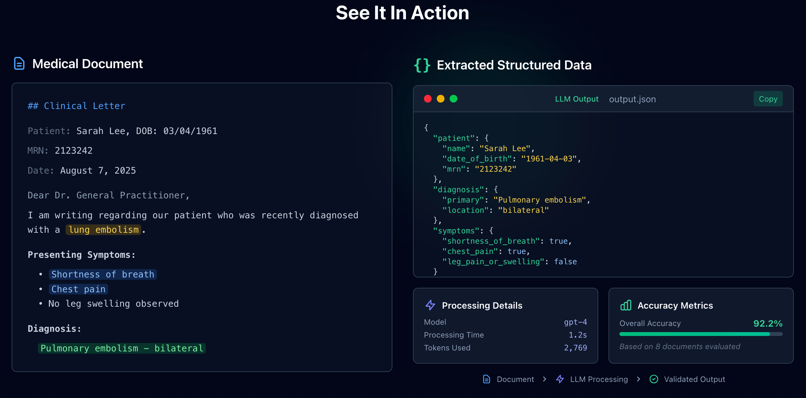

# LLMAIx (v2) Web


Provides a web interface for the LLMAIx framework, allowing users to interact with the library through a user-friendly interface.

## In Action




## Features


## Docker Installation


Setup the environment variables in `.env` file:
```bash
cp `.env.example` to `.env` and set the environment variables as needed.
```

Build the Docker image (either for GPU or CPU):

```
# GPU (requires NVIDIA driver + container toolkit), faster preprocessing
docker compose -f docker-compose.gpu.yml up -d --build

# CPU
docker compose -f docker-compose.cpu.yml up -d --build
```


## Get started

Visit the web interface at [http://localhost:5173](http://localhost:5173).

1. Create a Admin user account.
2. Log in with the created account.

## Development

**Initialize Users**
```bash
python -m backend.scripts.populate_users
```

In Docker Installation:

```bash
## REPLACE `docker-compose.gpu.yml` with `docker-compose.cpu.yml` for CPU stack
# Currently running stack
docker compose -f docker-compose.gpu.yml exec -it backend python -m backend.scripts.populate_users

# For a currently stopped stack, run:
docker compose -f docker-compose.gpu.yml run --rm -it backend python -m backend.scripts.populate_users
```

**Install Minio**

Start on MacOS:
```bash
minio server miniodata
```

**Run Backend Tests**
```bash
ENV_PATH=backend/.env uv run pytest --verbose
--cov=backend --cov-report=html
```