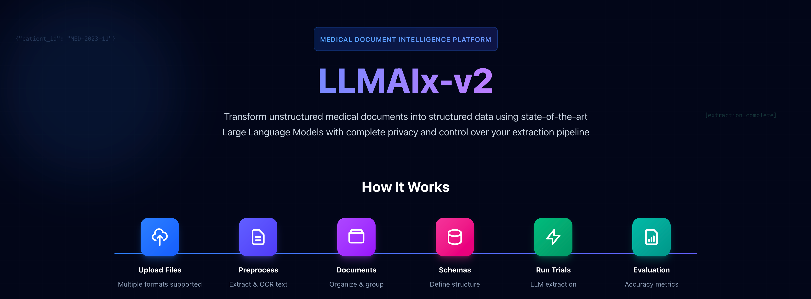

> [!IMPORTANT]  
> This application is an early preview. It may not run stably and extracted results can be inaccurate. Always check outputs for validity before using them in practice.

# LLMAIx (v2) Web



A modern web interface for the **LLMAIx** framework that turns unstructured medical documents into structured JSON with privacy‑first controls. The application includes an admin dashboard for configuring providers, prompts, schemas, and overrides, plus basic **user management** (e.g. invitations when enabled).

---

## ✨ Features

* **Upload & organize**: multi‑format file support (PDF, DOC/DOCX, PNG/JPEG images, CSV/XLSX) with column selection, grouping and previews.
* **Preprocessing & OCR**: pluggable methods including **Tesseract**, **Marker**, **PaddleOCR**, and vision LLMs; document parsers like **Docling**, **PyMuPDF4LLM**, and **MarkItDown**.
* **Visual schema editor**: tree‑based editor supporting nested objects/arrays, all JSON types, import/export, validation, and templates.
* **LLM trials**: run multiple extraction trials across prompts/models with temperature control, per‑trial iterations, token tracking, and OpenAI‑compatible endpoints (official OpenAI, vLLM, llama.cpp/Ollama, custom gateways).
* **Evaluation**: upload ground truth, compare field‑by‑field, compute overall/per‑field accuracy metrics.
* **Privacy‑first**: run fully locally or with self‑hosted providers; no forced external calls.
* **Admin dashboard**: provider configuration, **user management** (setup first admin, invitations/roles).

> Tech stack: **Vue 3 + Vite + TailwindCSS** (frontend), **FastAPI** (backend), **SQLAlchemy**, **Celery**, **Pydantic** for configuration.

---

## 📦 Requirements

* Node.js 18+ (for the frontend) and PNPM/NPM/Yarn
* Python 3.11+ (for the backend)
* Docker & Docker Compose (recommended for deployment)
* Optional GPU stack: NVIDIA driver + NVIDIA Container Toolkit
* **OpenAI-compatible API** (e.g., official OpenAI, self-hosted llama.cpp, vLLM, …)
* (Optional) **MinIO** for object storage or any other S3 storage

---

## 🐳 Docker Installation

1. Copy and edit environment files:

```bash
cp .env.example .env
```

### ⚙️ Environment Configuration
Edit the `.env` file to match your deployment:

* **LLM Providers (OpenAI compatible)**:
    * `OPENAI_API_KEY`: Your API key.
    * `OPENAI_API_BASE`: The base URL (e.g., `https://api.openai.com/v1` for official OpenAI, or your local vLLM/Ollama endpoint).
    * `OPENAI_API_MODEL`: Default model name to use.
    * `OPENAI_NO_API_CHECK`: Set to `true` to skip initial connectivity checks.
* **Network & CORS**:
    * `BACKEND_CORS_ORIGINS`: Comma-separated list of allowed origins (e.g., `http://localhost:5173,https://app.example.com`).
    * `VITE_API_BACKEND_URL`: The public URL of the backend API as seen by the browser (e.g., `http://localhost:8000/api/v1`).
* **Access Control**:
    * `REQUIRE_INVITATION`: Set to `true` to disable open registration; new users will then require an invitation from an admin.


2. Start the stack (choose GPU or CPU):

```bash
# GPU (requires NVIDIA driver + container toolkit)
docker compose -f docker-compose.gpu.yml up -d --build

# CPU
docker compose -f docker-compose.cpu.yml up -d --build
```

**Notes:**

* The GPU stack reserves an NVIDIA device via Compose `deploy.resources.reservations.devices`.
* Services included: `backend`, `worker_default`, `worker_preprocess`, `frontend`, `postgres`, `redis`, `minio`, and one‑shot `minio-init` (creates `S3_BUCKET_NAME`).
* The backend reads settings from `backend/.env` (see `ENV_PATH` in `backend/src/config.py`). The project `.env` is mounted into `/app/backend/.env` in the container.

3. Visit the web UI at **[http://localhost:5173](http://localhost:5173)**.

---

## 🚀 Get started

1. Open **[http://localhost:5173](http://localhost:5173)**.
2. Create an **Admin** account.
3. Log in with your new account and configure an LLM provider under *Settings*.
4. Upload a few documents, define a schema, and run your first trial.

---

## 🔧 Development

### Initialize users

```bash
python -m backend.scripts.populate_users
```

**When using Docker**

```bash
## Replace gpu compose file name with cpu if needed
# Running stack
docker compose -f docker-compose.gpu.yml exec -it backend \
  python -m backend.scripts.populate_users

# Stopped stack
docker compose -f docker-compose.gpu.yml run --rm -it backend \
  python -m backend.scripts.populate_users
```

### MinIO (optional for dev)

Start on macOS:

```bash
minio server miniodata
```

### Run backend tests

```bash
ENV_PATH=backend/.env uv run pytest --verbose --cov=backend --cov-report=html
```

---

## 🔐 Security & Privacy

* Keep PHI strictly local unless you explicitly configure a remote provider.
* Prefer self-hosted, OpenAI-compatible endpoints for clinical data.
* Review your `.env` secrets and never commit them.

---

## 📜 License

This project is licensed under the **AGPL-3.0**. See [LICENSE](LICENSE).
