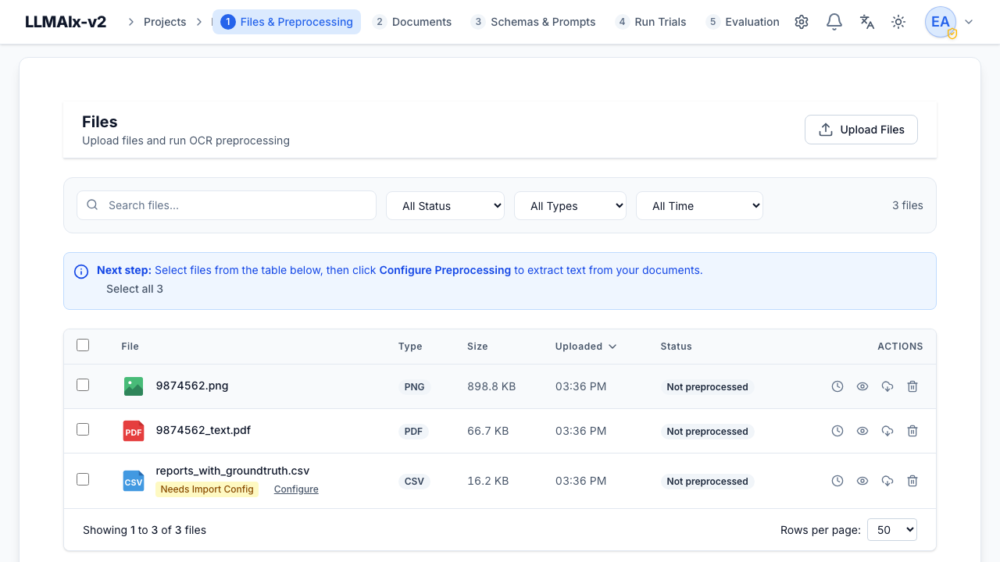
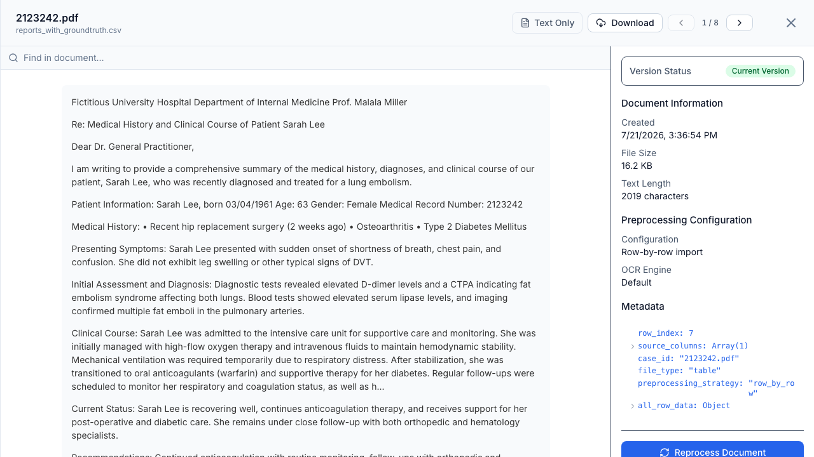
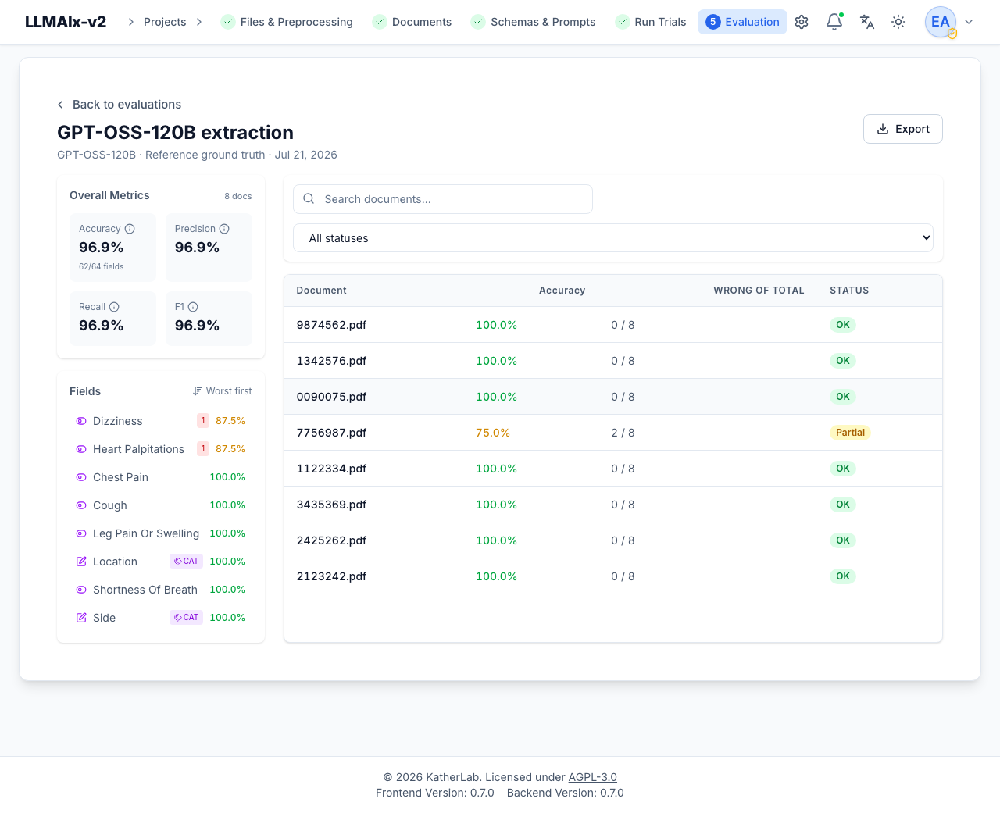

[](https://katherlab.github.io/llmaixweb/)
[](LICENSE)

> [!IMPORTANT]
> This application is a research prototype. It may not run stably and extracted results can be inaccurate. Always check outputs for validity before using them in practice.

# LLMAIx (v2) Web


A web application that turns unstructured medical/lab documents into structured JSON using LLMs. Upload PDFs, images, or spreadsheets — extract data with configurable schemas and prompts, then evaluate results against ground truth.

**Works with any OpenAI-compatible API:** use official services (OpenAI, Mistral OCR) for convenience, or run everything fully local with self-hosted models (DeepSeek-OCR-2 via [KatDocExtract](https://github.com/KatherLab/KatDocExtract), vision LLMs like Gemma 4 via vLLM) for sensitive environments.


> 📖 **Full documentation → [katherlab.github.io/llmaixweb](https://katherlab.github.io/llmaixweb/)**
> Installation, a per-page user guide, an operator handbook, and the developer reference.

---

## Features

* **Upload & organize** — PDF, DOC/DOCX, images, CSV/XLSX, TXT files with column selection and previews.
* **Preprocessing & OCR** — four extraction engines to choose from (see [OCR engines](https://katherlab.github.io/llmaixweb/user-guide/ocr-engines/)).
* **Visual schema editor** — tree-based JSON schema editor with nested objects, arrays, all JSON types, import/export, and validation.
* **LLM trials** — run extraction trials across different prompts, schemas, and models. Temperature control, token tracking, batch execution. Works with any OpenAI-compatible endpoint.
* **Evaluation** — upload ground truth CSVs, compare field-by-field, compute per-field and overall accuracy metrics.
* **Privacy-first** — run fully local or with self-hosted providers. No forced external calls.
* **Admin dashboard** — user management (invitations, roles), provider configuration, Celery monitoring.
* **Authentication & SSO** — email/password login with account lockout, refresh tokens, and optional OpenID Connect single sign-on (Google, Keycloak, Azure AD, …) with just-in-time user provisioning.

> Tech stack: **Vue 3 + Vite + TailwindCSS** (frontend), **FastAPI** (backend), **SQLAlchemy**, **Celery**, **Pydantic** for configuration.

---

## Screenshots

The full end-to-end workflow — from raw files to a scored extraction — using the eight fictitious lung-embolism reports that ship with the repo. Walk through it step by step in the **[quickstart](https://katherlab.github.io/llmaixweb/getting-started/quickstart/)**.

<table>
  <tr>
    <td width="50%" valign="top">
      
      <p><b>1. Upload &amp; preprocess</b><br>Bring in PDFs, images, and spreadsheets; extract text with your chosen OCR engine.</p>
    </td>
    <td width="50%" valign="top">
      
      <p><b>2. Review documents</b><br>Inspect the extracted text and its provenance before running a trial.</p>
    </td>
  </tr>
  <tr>
    <td width="50%" valign="top">
      
      <p><b>3. Run a trial</b><br>Pick a schema, prompt, model, and documents — against any OpenAI-compatible endpoint.</p>
    </td>
    <td width="50%" valign="top">
      
      <p><b>4. Inspect extractions</b><br>See each source report next to the structured JSON the model produced.</p>
    </td>
  </tr>
  <tr>
    <td width="50%" valign="top">
      
      <p><b>5. Map ground truth</b><br>Pair schema fields with known-correct columns and choose a comparison method per field.</p>
    </td>
    <td width="50%" valign="top">
      
      <p><b>6. Evaluate</b><br>Overall and per-field accuracy, per-document breakdowns, and confusion matrices.</p>
    </td>
  </tr>
</table>

---

## Quick start

```bash
git clone https://github.com/KatherLab/llmaixweb
cd llmaixweb
cp .env.example .env
# Edit .env — at minimum SECRET_KEY (OPENAI_API_* are optional)

docker compose up -d
```

Open **[http://localhost:5173](http://localhost:5173)** and create an admin account on first visit.

For OCR engines, compose overlays, environment variables, and self-hosted setups, see the **[Installation guide](https://katherlab.github.io/llmaixweb/getting-started/installation/)**.

---

## Documentation

| Guide | Link |
|-------|------|
| **Quickstart walkthrough** — CSV of 8 reports → evaluated results | [docs](https://katherlab.github.io/llmaixweb/getting-started/quickstart/) |
| **User guide** — a page per tab (Files → Preprocessing → Documents → Schemas → Trials → Evaluation) | [docs](https://katherlab.github.io/llmaixweb/user-guide/) |
| **Administration** — users, SSO, settings, task monitoring | [docs](https://katherlab.github.io/llmaixweb/admin/) |
| **Operations** — deployment, configuration, upgrading, backups, troubleshooting | [docs](https://katherlab.github.io/llmaixweb/operations/deployment/) |
| **Security & governance** — threat model, data flow, retention, DPIA | [docs](https://katherlab.github.io/llmaixweb/SECURITY/) |
| **Development** — contributing, developer guide, architecture | [docs](https://katherlab.github.io/llmaixweb/development/contributing/) |

The long-form guides also live in-repo: [USAGE.md](USAGE.md), [DEPLOY.md](DEPLOY.md), [DEVELOPER.md](DEVELOPER.md), and [AGENTS.md](AGENTS.md).

---

## Security & privacy

* Keep PHI strictly local unless you explicitly configure a remote provider.
* Prefer self-hosted, OpenAI-compatible endpoints for clinical data.
* Review your `.env` secrets and never commit them.
* Report vulnerabilities privately — see [SECURITY.md](.github/SECURITY.md).

Not a certified medical device. The deploying institution is the data controller; see the [security & governance docs](https://katherlab.github.io/llmaixweb/SECURITY/).

---

## License

**AGPL-3.0** — see [LICENSE](LICENSE). Third-party components are listed in [THIRD_PARTY_NOTICES.md](THIRD_PARTY_NOTICES.md).
