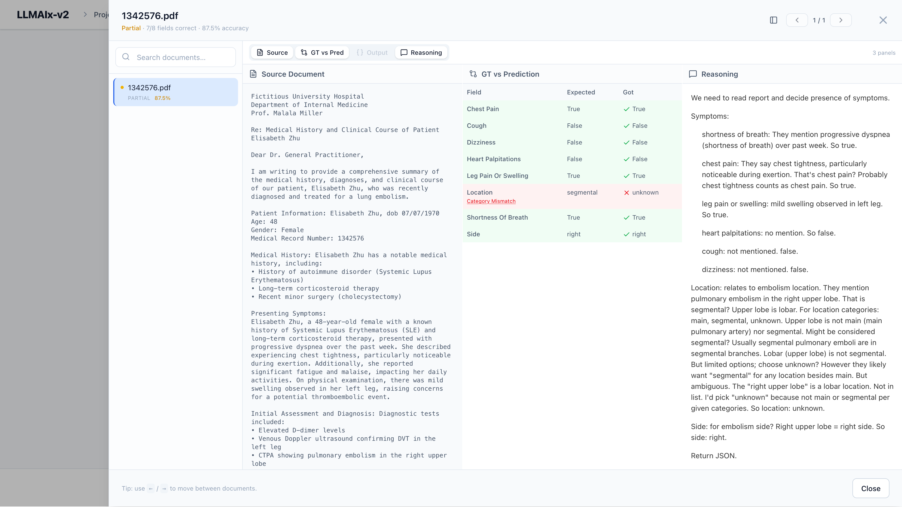

> [!IMPORTANT]
> This application is an early preview. It may not run stably and extracted results can be inaccurate. Always check outputs for validity before using them in practice.

# LLMAIx (v2) Web


A web application that turns unstructured medical/lab documents into structured JSON using LLMs. Upload PDFs, images, or spreadsheets — extract data with configurable schemas and prompts, then evaluate results against ground truth.

**Works with any OpenAI-compatible API:** use official services (OpenAI, Mistral OCR) for convenience, or run everything fully local with self-hosted models (DeepSeek-OCR-2 via [KatDocExtract](https://github.com/KatherLab/KatDocExtract), vision LLMs like Gemma 4 via vLLM) for sensitive environments.



---

## Features

* **Upload & organize** — PDF, DOC/DOCX, images, CSV/XLSX, TXT files with column selection and previews.
* **Preprocessing & OCR** — four extraction engines to choose from (see [Preprocessing Guide](#preprocessing-guide))
* **Visual schema editor** — tree-based JSON schema editor with support for nested objects, arrays, all JSON types, import/export, and validation.
* **LLM trials** — run extraction trials across different prompts, schemas, and models. Temperature control, token tracking, batch execution. Works with any OpenAI-compatible endpoint.
* **Evaluation** — upload ground truth CSVs, compare field-by-field, compute per-field and overall accuracy metrics.
* **Privacy-first** — run fully local or with self-hosted providers. No forced external calls.
* **Admin dashboard** — user management (invitations, roles), provider configuration, Celery monitoring.
* **Authentication & SSO** — email/password login with account lockout, refresh tokens, and optional OpenID Connect single sign-on (Google, Keycloak, Azure AD, …) with just-in-time user provisioning.

> Tech stack: **Vue 3 + Vite + TailwindCSS** (frontend), **FastAPI** (backend), **SQLAlchemy**, **Celery**, **Pydantic** for configuration.

> 📖 **New here?** See the [Usage Example](USAGE.md) for a complete, step-by-step walkthrough — from a CSV of 8 medical reports to evaluated extraction results — using the original LLMAIx example dataset, schema, and prompt.

---

## Preprocessing Guide

Before extracting data with an LLM, you need to turn your files into plain text. This step is called **preprocessing** (or OCR/text extraction). The app offers four engines — pick whichever works best for your document type.

### 1. Quick (Local OCR) — no API needed

Uses **Docling-serve** (remote service running Docling + Tesseract) to extract text. The engine detects whether a PDF already has embedded text and uses it directly. For scanned pages or images, it runs Tesseract OCR locally.

- **Best for:** Any document; works offline, no extra cost
- **Limitations:** Slower for large batches; Tesseract accuracy varies with image quality
- **Force OCR:** Enable this to treat all PDF pages as images (bypasses native text)

### 2. Mistral OCR API

Sends pages to a Mistral OCR-compatible API. This can be the official Mistral cloud service or a self-hosted DeepSeek-OCR-2 instance ([KatDocExtract](https://github.com/KatherLab/KatDocExtract)).

- **Best for:** Complex layouts, tables, forms — higher accuracy than local OCR
- **Limitations:** Requires an API key and network access (or GPU + compose overlay)
- **Tip:** The engine automatically checks for embedded PDF text first. If enough text is found, it uses Docling without OCR locally, saving the API call. Disable this with "Force OCR".

### 3. Vision LLM OCR

Sends pages as images to any OpenAI-compatible vision model (GPT-4o, Gemma 4 via vLLM, etc.).

- **Best for:** Documents requiring understanding of layout and visual context
- **Limitations:** Slower and more expensive than dedicated OCR; requires a vision-capable model
- **Tip:** Same embedded-text shortcut as Mistral OCR — only sends pages to the vision model when really needed.

### 4. Local Docling Fallback (Optional)

When `DOCLING_LOCAL_FALLBACK=true`, the backend can run Docling locally as a fallback if docling-serve is unavailable. Requires installing `docling-slim` in the dev dependency group.

### Force OCR

When enabled, the embedded-text pre-check is **skipped**, and every page goes through the selected engine. Useful for PDFs with garbled or incomplete embedded text.

> **Self-hosted:** Use `docker compose -f compose.yml -f compose.deepseek.yml up -d` for local Mistral OCR, or `docker compose -f compose.yml -f compose.vllm.yml up -d` for a local vision LLM endpoint. See [Compose Files](#compose-files).

---

## Requirements

* Docker & Docker Compose (recommended for deployment)
* **An OpenAI-compatible API** — official OpenAI, self-hosted vLLM, Ollama, llama.cpp, or any compatible gateway
* Optional: NVIDIA GPU + Container Toolkit (only needed for self-hosted OCR/LLM via the optional compose overlays)
* For local development: Node.js 18+ + Python 3.13+

---

## Docker Installation

### Quick Start

1. Clone the repository and set up environment:
```bash
git clone https://github.com/KatherLab/llmaixweb
cd llmaixweb
cp .env.example .env
# Edit .env with at minimum: SECRET_KEY, OPENAI_API_KEY, OPENAI_API_BASE, OPENAI_API_MODEL
```

2. Start the stack:
```bash
docker compose up -d
```

3. Open **[http://localhost:5173](http://localhost:5173)** and create an admin account on first visit.

4. In the admin panel, configure your LLM provider, then upload documents and run extraction trials.

> **First run:** Images may take a few minutes to download. Watch progress with `docker compose logs -f` — once the backend health check passes and migrations finish, the app is ready at [http://localhost:5173](http://localhost:5173).

> Pre-built images at `ghcr.io/katherlab/llmaixweb-backend:latest` and `ghcr.io/katherlab/llmaixweb-frontend:latest`. Add `--build` to build from source.

### Compose Files

| File                   | Purpose                                                                                               | GPU required?               |
|------------------------|-------------------------------------------------------------------------------------------------------|-----------------------------|
| `compose.yml`          | **Main config** — CPU-only, works with Docker & Podman                                                | No                          |
| `compose.dev.yml`      | **Optional overlay** — hot-reload for local development                                               | No                          |
| `compose.deepseek.yml` | **Optional overlay** — self-hosted Mistral OCR API via DeepSeek-OCR-2 + [KatDocExtract](https://github.com/KatherLab/KatDocExtract) | Yes (24+ GB VRAM)           |
| `compose.vllm.yml`     | **Optional overlay** — self-hosted OpenAI-compatible endpoint via vLLM (e.g., Gemma 4 for Vision OCR) | Yes (VRAM depends on model) |

**Usage examples:**
```bash
# Minimal setup (CPU, uses your configured API provider)
docker compose up -d

# Development with hot-reload
docker compose -f compose.yml -f compose.dev.yml up -d

# Self-hosted Mistral OCR via DeepSeek-OCR-2 (GPU required)
docker compose -f compose.yml -f compose.deepseek.yml up -d

# Self-hosted vision LLM via vLLM (GPU required)
docker compose -f compose.yml -f compose.vllm.yml up -d

# Combine overlays: e.g., all services
docker compose -f compose.yml -f compose.deepseek.yml -f compose.vllm.yml up -d
```

> The overlays (`compose.deepseek.yml`, `compose.vllm.yml`) are **optional** GPU-requiring services for running OCR/LLM locally. Without them, the app simply connects to your configured remote API.

### Environment Configuration

Edit `.env` for your deployment. **At minimum**, configure your LLM provider and a secret key.

#### Essential Settings

| Variable           | Description                                                                                             | Default    |
|--------------------|---------------------------------------------------------------------------------------------------------|------------|
| `OPENAI_API_KEY`   | API key for LLM provider                                                                                | (required) |
| `OPENAI_API_BASE`  | Base URL for OpenAI-compatible API                                                                      | (empty)    |
| `OPENAI_API_MODEL` | Default model to use                                                                                    | (empty)    |
| `SECRET_KEY`       | Secret key for sessions (generate with `python3 -c "import secrets; print(secrets.token_urlsafe(32))"`) | (required) |

#### Storage

**RustFS** (default with docker-compose):

| Variable                | Default              |
|-------------------------|----------------------|
| `AWS_ACCESS_KEY_ID`     | `rustfsadmin`        |
| `AWS_SECRET_ACCESS_KEY` | `rustfsadmin`        |
| `S3_ENDPOINT_URL`       | `http://rustfs:9000` |
| `S3_BUCKET_NAME`        | `llmaixweb`          |

**Local filesystem** (alternative):

| Variable          | Description                     |
|-------------------|---------------------------------|
| `LOCAL_DIRECTORY` | Path to local storage directory |

#### Other Settings

| Variable                  | Description                           | Default                        |
|---------------------------|---------------------------------------|--------------------------------|
| `APP_URL`                 | Public app URL (for links in emails)  | `http://localhost:5173`        |
| `BACKEND_CORS_ORIGINS`    | Comma-separated allowed origins       | `http://localhost:5173`        |
| `REQUIRE_INVITATION`      | Require invitation for signup         | `false`                        |
| `ALLOW_FIRST_ADMIN_SETUP` | Allow first user to become admin      | `true`                         |
| `PASSWORD_POLICY_*`       | Password complexity rules (length, upper/lower/digit/symbol) | min 8, require upper/lower/digit |
| `LOGIN_MAX_ATTEMPTS`      | Failed logins before account lockout  | `5`                            |
| `LOGIN_LOCKOUT_MINUTES`   | Account lockout duration              | `15`                           |
| `REFRESH_TOKEN_EXPIRE_DAYS` | Refresh token lifetime (rotatable, revocable) | `30`                    |
| `SSO_ENABLED`             | Enable OpenID Connect single sign-on  | `false`                        |
| `SSO_JIT_DEFAULT_ROLE`    | Role for SSO auto-provisioned users   | `user`                         |
| `SSO_BYPASS_INVITATION`   | SSO login bypasses `REQUIRE_INVITATION` | `true`                       |
| `CELERY_PREPROCESS_POOL`  | Pool type (`auto`, `solo`, `prefork`) | `auto` (use `solo` on macOS)   |
| `MISTRAL_API_BASE`        | Mistral OCR API base URL              | `https://api.mistral.ai`       |
| `MISTRAL_API_KEY`         | Mistral OCR API key (server default)  | (empty)                        |
| `MISTRAL_OCR_ENABLED`     | Enable Mistral OCR engine             | `false`                        |
| `VISION_OCR_ENABLED`      | Enable Vision LLM OCR engine          | `false`                        |
| `VISION_OCR_API_KEY`      | Vision OCR API key (server default)   | (empty)                        |
| `VISION_OCR_API_BASE`     | Vision OCR API base URL               | (empty)                        |
| `VISION_OCR_MODEL`        | Vision OCR default model              | `gpt-4o`                       |

> **Self-hosted OCR:** Use `docker compose -f compose.yml -f compose.deepseek.yml up -d` for a local Mistral OCR-compatible API (DeepSeek-OCR-2 via [KatDocExtract](https://github.com/KatherLab/KatDocExtract)). Use `docker compose -f compose.yml -f compose.vllm.yml up -d` for a local vision LLM endpoint (e.g. Gemma 4). Then set the corresponding `MISTRAL_API_BASE`/`VISION_OCR_API_BASE` env vars. See `.env.example` for details.

<details>
<summary>Database & Advanced Settings (click to expand)</summary>

| Variable                      | Description                  | Default                |
|-------------------------------|------------------------------|------------------------|
| `POSTGRES_SERVER`             | Database host                | `postgres`             |
| `POSTGRES_USER`               | Database user                | `postgres`             |
| `POSTGRES_PASSWORD`           | Database password            | `postgres`             |
| `POSTGRES_DB`                 | Database name                | `llmaixweb`            |
| `CELERY_BROKER_URL`           | Redis broker URL             | `redis://redis:6379/0` |
| `CELERY_RESULT_BACKEND`       | Redis result backend         | `redis://redis:6379/0` |
| `DISABLE_CELERY`              | Disable Celery workers       | `false`                |
| `INITIALIZE_CELERY`           | Initialize Celery on startup | `false`                |
| `ACCESS_TOKEN_EXPIRE_MINUTES` | Token expiry in minutes      | `60*24*8`              |
| `RUSTFS_ACCESS_KEY`           | RustFS access key            | `rustfsadmin`          |
| `RUSTFS_SECRET_KEY`           | RustFS secret key            | `rustfsadmin`          |

</details>

#### Local Network & Reverse Proxy

The frontend nginx proxies `/api/` requests to the backend, so only one URL is needed.
The `APP_URL` env var controls invitation/password-reset link construction.

> **Testing in local network?** Access from other devices requires:
> 1. Set `APP_URL` to your server IP (e.g., `http://192.168.1.100:5173`)
> 2. Set `BACKEND_CORS_ORIGINS` to include your server IP (e.g., `http://192.168.1.100:5173`)
> 3. Restart the stack
>
> **Using a reverse proxy (nginx, Traefik, etc.)?** Adjust:
> - `APP_URL` to your public domain (e.g., `https://app.example.com`)
> - `BACKEND_CORS_ORIGINS` to your public domain (e.g., `https://app.example.com`)

## Troubleshooting

### Port 5173 already in use
The frontend binds to `5173:8080`. Change the host port in `compose.yml`:
```yaml
ports: ["5174:8080"]
```

### Backend won't start / "Connection refused" errors
The backend waits for Postgres, Redis, RustFS, and docling-serve to be healthy. Ensure they're up:
```bash
docker compose ps                    # check all services are running
docker compose logs backend | tail   # check backend logs
docker compose logs postgres | tail  # check database logs
```

### "OpenAI API connection failed"
Your `.env` has `OPENAI_API_KEY` / `OPENAI_API_BASE` / `OPENAI_API_MODEL` empty or unreachable. These are required for extraction. To skip the startup check (e.g. if you configure providers in the admin UI later), set:
```bash
OPENAI_NO_API_CHECK=true
```

### Database migration errors
If the schema has changed between versions, migrations run automatically. Reset the database if needed (⚠️ **destroys all data**):
```bash
docker compose down -v        # removes volumes including pgdata
docker compose up -d          # fresh start
```

### Slow preprocessing / stuck tasks
Celery workers may not be starting. Check:
```bash
docker compose logs worker_default
docker compose logs worker_preprocess
```
On macOS, multiprocessing issues can occur — set `CELERY_PREPROCESS_POOL=solo` in `.env`.

### Still stuck?
Open an issue at [github.com/KatherLab/llmaixweb/issues](https://github.com/KatherLab/llmaixweb/issues).

---

## Usage Example

For a complete end-to-end walkthrough (upload → preprocess → schema/prompt → trial → evaluation) using the 8-report lung-embolism example dataset, see [USAGE.md](USAGE.md).

---

## Development

See [DEVELOPER.md](DEVELOPER.md) for local development and testing instructions.

---

## Deployment

For production deployment — architecture, reverse proxy/TLS, backups, upgrades,
health checks, and a security checklist — see [DEPLOY.md](DEPLOY.md).

---

## Security & Privacy

* Keep PHI strictly local unless you explicitly configure a remote provider.
* Prefer self-hosted, OpenAI-compatible endpoints for clinical data.
* Review your `.env` secrets and never commit them.

---

## License

**AGPL-3.0** — see [LICENSE](LICENSE).
