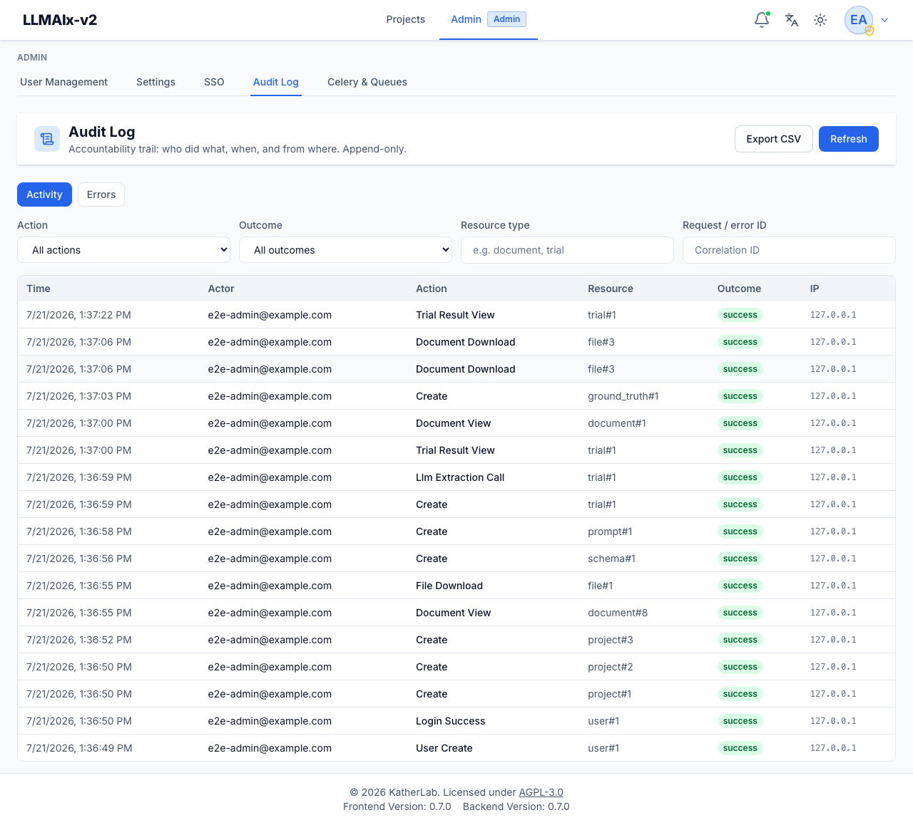

# Audit Logging & Central Error Log

LLMAIx Web records an **append-only audit trail** and a **central error log** to
support the accountability requirements of a clinical deployment. This document
explains what is recorded, how to read it, and how to operate it.

Admins read both from **Admin → Audit Log**:

<figure markdown>
  { width="820" }
  <figcaption>The Audit Log UI: the append-only activity table with Activity/Errors tabs, Action/Outcome/Resource-type/Correlation-ID filters, and Export CSV.</figcaption>
</figure>

## What gets recorded

### Audit trail (`audit_logs`)

Written by `backend/src/utils/audit.py:record_audit` at chokepoints across the
app. Each row captures **who / what / when / from where** and never contains
PHI (no document text or extracted values — only ids, counts, names, hosts).

Recorded actions (`AuditAction` in `backend/src/utils/enums.py`):

| Group | Actions |
|-------|---------|
| Authentication | `login_success`, `login_failure`, `logout`, `token_refresh`, `account_locked`, `password_change`, `password_reset`, `sso_login` |
| Access (PHI) | `document_view`, `document_download`, `file_download`, `trial_result_view`, `export` |
| Mutations | `create`, `update`, `delete`, `cancel` (discriminated by `resource_type`) |
| Egress (PHI leaves) | `llm_extraction_call`, `ocr_external_call` — records endpoint host, model, document count |
| Administration | `setting_change`, `user_create` (incl. the **first-admin bootstrap**, flagged `first_admin: true`), `user_role_change`, `user_deactivate`, `invitation_send`, `sso_provider_change` |

Each row: timestamp, actor (user id + email snapshot + IP), action, resource
type/id, project id, outcome (`success`/`failure`/`denied`), a small PHI-free
`detail` JSON, and the request **correlation id**.

> The trail is **append-only by construction**: the service exposes only an
> insert path, there are no update/delete routes, and the admin API is
> read-only. Rows are written in an independent transaction so they survive a
> rollback of the business operation and never break a request if the audit
> write itself fails.

### Error log (`error_logs`)

Every unhandled server error is caught by the global handler
(`backend/src/middleware/error_handlers.py`), which:

1. assigns a short **error id** (the request correlation id),
2. logs the full traceback under that id,
3. writes an `error_logs` row (endpoint, exception type, message, traceback,
   actor), and
4. returns `{ "error_id": ..., "message": "… Quote this ID to your
   administrator …" }` to the client — **no exception detail leaks**.

The user sees the id in the error toast; an admin looks it up to see the trace.

## How to read it (admins)

In the app: **Admin → Audit Log**.

- **Activity** tab: filter by action, outcome, resource type, or correlation id;
  click a row for full detail; **Export CSV** for the current filter.
- **Errors** tab: paste an **error id** a user reported to pull up the full
  traceback, or browse recent errors.

API (admin-only, read-only):

- `GET /api/v1/admin/audit` — paginated, filterable (`action`, `outcome`,
  `actor_user_id`, `resource_type`, `project_id`, `request_id`, `start`, `end`).
- `GET /api/v1/admin/audit/export` — CSV stream of the filtered trail.
- `GET /api/v1/admin/errors?error_id=<id>` — look up one error, or list recent.

## Correlation across logs

The same **correlation id** appears in (a) the app log line, (b) the audit row's
`request_id`, (c) the error log's `error_id`/`request_id`, and (d) the
`X-Request-ID` response header. Given one id you can pivot across all four.

Set `LOG_FORMAT=json` to emit structured logs (one object per line, including
`request_id`) for ingestion into a SIEM/Loki.

## Operations

- **Retention.** The audit and error tables grow with use. Include them in your
  database backups. If you must prune, do so from the database side per your
  retention policy (see [DATA_RETENTION.md](./DATA_RETENTION.md)); the
  application intentionally provides no delete path.
- **Forwarding.** For tamper-resistance beyond an in-database append-only table,
  ship the JSON logs (which include audit lines) to an external, write-once sink
  (syslog/SIEM). This is the recommended upgrade for higher-assurance settings.
- **Volume.** `document_view` is recorded on every single-document open; on a
  high-traffic deployment this is the highest-volume audit action. It is indexed
  by `(project_id, created_at)` and `(actor_user_id, created_at)` for efficient
  filtering.

## What is intentionally *not* logged

- No PHI: document text, extracted field values, and ground-truth values are
  never written to the audit trail, error log, or application logs.
- Setting **values** are not audited (only the keys that changed), since some
  settings are security-relevant.
