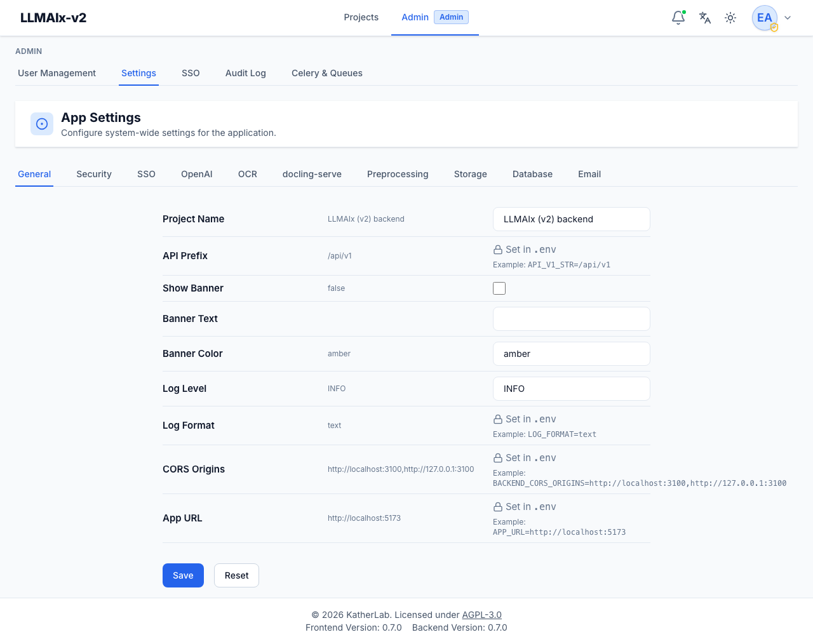

# System settings

**App Settings** (`/admin/settings`) configures the running system. Settings are
grouped into category tabs — General, Security, SSO, OpenAI, OCR, docling-serve,
Preprocessing, Storage, Database, Email. The tabs are derived from the categories
actually present in the settings payload, so the exact set you see depends on
your build; they appear in that preferred order, with any extra category
appended at the end.

<figure markdown>
  { width="820" }
  <figcaption>App Settings: each row shows the effective value, an editable field (or a lock icon with a .env example for read-only settings), and Save / Reset at the bottom.</figcaption>
</figure>

## Reading a settings row

Every setting is one row with three columns:

1. **Label & description** — the setting's human name and a short explanation.
2. **Current value** — what is in effect right now. If you've applied a runtime
   override, the original environment value is shown **struck through** with the
   override highlighted next to it. Secrets show **Set** / **Not Set** instead of
   a value.
3. **Edit control** — how you change it, which depends on the setting's type
   (below).

## How settings work

Each setting is edited according to its type:

- **Read-only (.env)** — set only via the environment; shown with a lock icon and
  its `KEY=value` example. These can't be changed from the UI. To change one,
  edit the environment/`.env` and restart. Security- and infrastructure-critical
  keys are intentionally read-only.
- **Secret** — shown as **Set** / **Not Set**, never revealing the value.
  **Set** / **Update** reveals a password field with **Save** / **Cancel**;
  **Clear** removes the override. Secrets are stored **encrypted** at rest.
- **Boolean** — a checkbox.
- **Integer** — a number field.
- **String** — a text field.

A **Revert** button appears on any boolean/integer/string setting you've
overridden, returning it to the environment default (it deletes the stored
override). Secrets use **Clear** for the equivalent.

At the bottom of the form:

- **Save** — persists every edited (non-secret, non-read-only) field at once.
  Secrets are saved individually from their own row, not by this button.
- **Reset** — discards your unsaved edits in the form and restores the fields to
  the currently persisted values. It does **not** touch already-saved overrides.

After a successful save the form re-fetches from the backend so the displayed
state matches exactly what was persisted.

!!! note "Only differences are stored"
    A runtime override is saved only when it **differs** from the environment
    default; setting a value back to the default removes the override. Setting
    changes are audited (keys only — never the values).

!!! warning "Overrides are cached and broadcast"
    Runtime overrides are stored in the `app_settings` database table and cached
    in-process. On save, the change is published so all workers invalidate their
    cache; you normally don't need a restart for an override to take effect. A
    read-only `.env` change, by contrast, requires a restart.

## Category tabs at a glance

| Tab | Typical settings |
| --- | --- |
| **General** | Site name, base URL, banner, registration flags. |
| **Security** | Password policy, account lockout, token lifetimes, rate limiting, egress allowlists. |
| **SSO** | The global **SSO Enabled** switch and related SSO defaults (provider CRUD lives on the [SSO page](sso.md)). |
| **OpenAI** | Default LLM API key, base URL, and model for extraction. |
| **OCR** | Enable/configure the OCR engines (Mistral OCR, Vision LLM) and their endpoints/models. |
| **docling-serve** | The docling-serve endpoint used for embedded-text extraction and Tesseract OCR. |
| **Preprocessing** | Defaults for the preprocessing pipeline (e.g. OCR fallback thresholds). |
| **Storage** | Local directory vs S3-compatible storage, upload size limits. |
| **Database** | Database connection details (usually read-only `.env`). |
| **Email** | SMTP settings used for invitations and password resets. |

For the full catalog of settings and what each does, see
[`.env.example`](https://github.com/KatherLab/llmaixweb/blob/main/.env.example)
and the [Configuration](../operations/configuration.md) page.

!!! tip "OCR engines"
    The OCR-related tabs are where you enable the engines that appear in the
    [preprocessing](../user-guide/preprocessing.md) panel (local Docling/Tesseract,
    Mistral OCR, Vision LLM) and set their default endpoints and models.
