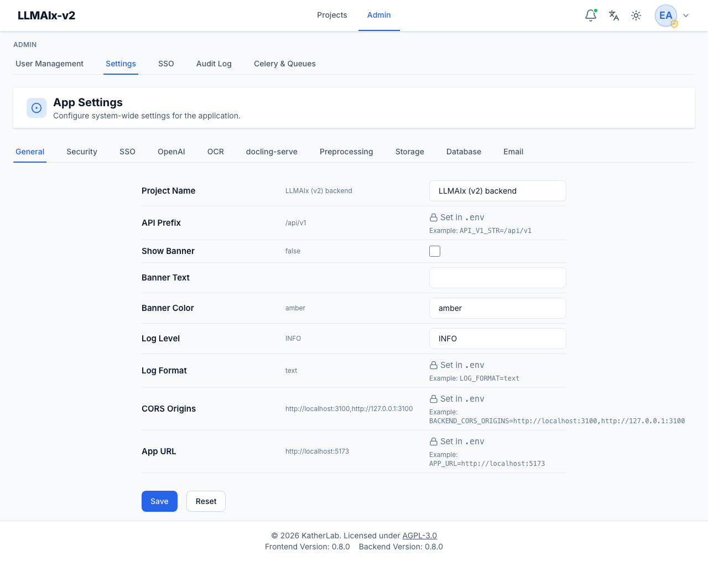

# System settings

**App Settings** (`/admin/settings`) configures the running system. Settings are
grouped into category tabs — General, Security, SSO, OpenAI, OCR, docling-serve,
Preprocessing, Storage, Database, Email. The tabs are derived from the categories
actually present in the settings payload, so the exact set you see depends on
your build; they appear in that preferred order, with any extra category
appended at the end.

<figure markdown>
  { width="820" }
  <figcaption>App Settings: each row shows the effective value, an editable field (or a lock icon with a .env example for read-only settings), and Save / Reset at the bottom.</figcaption>
</figure>

## Reading a settings row

Every setting is one row with three columns:

1. **Label & description** — the setting's human name and a short explanation.
2. **Current value** — what is in effect right now. If you've applied a runtime
   override, the original environment value is shown **struck through** with the
   override highlighted next to it. Secrets show **Set** / **Not Set** instead of
   a value.
3. **Edit control** — how you change it, which depends on the setting's type
   (below).

## How settings work

Each setting is edited according to its type:

- **Read-only (.env)** — set only via the environment; shown with a lock icon and
  its `KEY=value` example. These can't be changed from the UI. To change one,
  edit the environment/`.env` and restart. Security- and infrastructure-critical
  keys are intentionally read-only.
- **Secret** — shown as **Set** / **Not Set**, never revealing the value.
  **Set** / **Update** reveals a password field with **Save** / **Cancel**;
  **Clear** removes the override. Secrets are stored **encrypted** at rest.
- **Boolean** — a checkbox.
- **Integer** — a number field.
- **String** — a text field.

A **Revert** button appears on any boolean/integer/string setting you've
overridden, returning it to the environment default (it deletes the stored
override). Secrets use **Clear** for the equivalent.

At the bottom of the form:

- **Save** — persists every edited (non-secret, non-read-only) field at once.
  Secrets are saved individually from their own row, not by this button.
- **Reset** — discards your unsaved edits in the form and restores the fields to
  the currently persisted values. It does **not** touch already-saved overrides.

After a successful save the form re-fetches from the backend so the displayed
state matches exactly what was persisted.

!!! note "Only differences are stored"
    A runtime override is saved only when it **differs** from the environment
    default; setting a value back to the default removes the override. Setting
    changes are audited (keys only — never the values).

!!! warning "Overrides are cached and broadcast"
    Runtime overrides are stored in the `app_settings` database table and cached
    in-process. On save, the change is published so all workers invalidate their
    cache; you normally don't need a restart for an override to take effect. A
    read-only `.env` change, by contrast, requires a restart.

## Category tabs at a glance

| Tab | Typical settings |
| --- | --- |
| **General** | Site name, base URL, banner, registration flags. |
| **Security** | Password policy, account lockout, token lifetimes, rate limiting, egress allowlists. |
| **SSO** | The global **SSO Enabled** switch and related SSO defaults (provider CRUD lives on the [SSO page](sso.md)). |
| **OpenAI** | Default LLM API key, base URL, and model for extraction. |
| **OCR** | Enable/configure the OCR engines (Mistral OCR, Vision LLM) and their endpoints/models. |
| **docling-serve** | The docling-serve endpoint used for embedded-text extraction and Tesseract OCR. |
| **Preprocessing** | Defaults for the preprocessing pipeline (e.g. OCR fallback thresholds). |
| **Storage** | Local directory vs S3-compatible storage, upload size limits. |
| **Database** | Database connection details (usually read-only `.env`). |
| **Email** | SMTP settings plus the notification-email switches. See [Email & notifications](#email-notifications). |

For the full catalog of settings and what each does, see
[`.env.example`](https://github.com/KatherLab/llmaixweb/blob/main/.env.example)
and the [Configuration](../operations/configuration.md) page.

!!! tip "OCR engines"
    The OCR-related tabs are where you enable the engines that appear in the
    [preprocessing](../user-guide/preprocessing.md) panel (local Docling/Tesseract,
    Mistral OCR, Vision LLM) and set their default endpoints and models.

## Email & notifications

The **Email** tab holds two kinds of setting: the SMTP connection, and the
policy for *notification* email on top of it.

`EMAIL_ENABLED` plus the `SMTP_*` values are the transport. With them
unconfigured the instance sends nothing at all: invitations fall back to copying
a link by hand, password reset shows a warning, and no notifications are sent.

### Verifying SMTP

The **Send test email** button (visible only on this tab) sends a message to the
signed-in admin's own address and reports whether the SMTP server accepted it.
It always sends to you — never to an address you type — so the button can't be
used as an open relay, and it is rate-limited to 5 attempts per minute.

!!! warning "Test after saving"
    The test uses the settings **currently stored**, not unsaved edits in the
    form. Press **Save** first, then **Send test email**.

### Notification policy

| Setting | What it does |
| --- | --- |
| **Notification Emails Enabled** | Master switch for notification email. Turning it off silences job/share/security/admin email while leaving invitations and password resets working — so account recovery keeps functioning. |
| **Minimum Job Duration (seconds)** | Jobs that finish faster than this never trigger a "finished" email. Default 120. Users may set their own value in [Account settings](../user-guide/account.md#email-notifications). |
| **Admin Alert Cooldown (minutes)** | Minimum gap between two admin alerts of the same kind, so a crash-looping worker can't mail every admin on every occurrence. Default 60. |
| **Presence TTL (seconds)** | Read-only (`.env`). How long a user counts as "online" after their last WebSocket heartbeat; this backs the per-user "only notify me when I'm away" preference. Keep it well above the frontend's 45-second ping interval. |

What gets sent to whom, and the opt-outs each user controls, is documented in
[Account settings → Email notifications](../user-guide/account.md#email-notifications).

!!! note "Presence tracking needs Redis"
    The "only when I'm away" preference is answered by a short-lived Redis key
    written by the web process and read by the Celery worker that finishes the
    job. Without Redis (or with a non-Redis broker) every user is treated as
    away, so job email is sent regardless of whether they have the app open.

!!! note "Notification email contains no PHI"
    Notification bodies carry counts, timings, model names, and the labels users
    chose themselves — project and run names. They never contain document text,
    extracted values, file names, or per-document error messages. Unhandled-error
    alerts carry only the error ID; the message and stack trace stay in the
    [error log](../AUDIT_LOGGING.md). Because project and run names *do* leave the system by
    email, tell users not to put patient identifiers in them.
