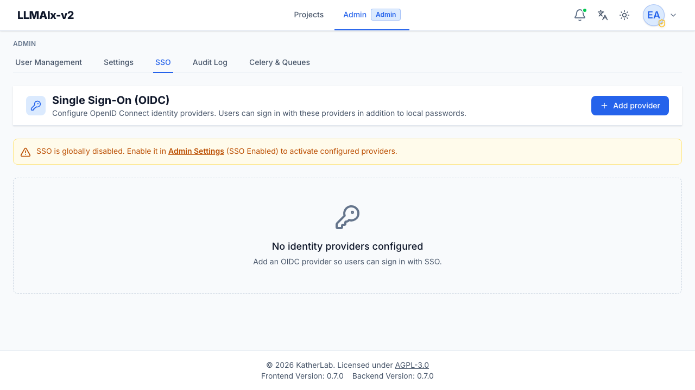

# Single sign-on (SSO)

**Single Sign-On (OIDC)** (`/admin/sso`) manages OpenID Connect identity
providers (Google, Keycloak, Azure AD, and any OIDC-compliant provider). The page
lists configured providers as cards and has an **Add provider** button in the
header.

<figure markdown>
  { width="820" }
  <figcaption>The SSO page: a warning that SSO is globally disabled until enabled in Settings, plus the empty "no identity providers configured" state.</figcaption>
</figure>

!!! note "Enable SSO globally first"
    SSO must be enabled in [system settings](settings.md) (**SSO Enabled**). When
    it's off, the page shows a warning banner with a link straight to the
    settings tab. You can still add and configure providers while SSO is
    globally off — they just won't appear on the login page until you flip the
    global switch.

## Adding a provider

**Add provider** opens a form:

- **Display name** — the label users see on the login page (e.g. "Google").
- **Issuer URL** — the provider's base URL; the app discovers its configuration
  from `{issuer}/.well-known/openid-configuration` (for example
  `https://accounts.google.com`).
- **Client ID** and **Client secret** — from the provider. The secret is stored
  **encrypted**. On **create**, the client secret is required. On **edit**, leave
  it blank to keep the current one — only enter a value to rotate it.
- **Scopes** — space-separated OIDC scopes; defaults to `openid email profile`.
- **Enabled** — whether the provider is live and offered on the login page.

## Managing providers

Each provider row shows:

- its **display name** and an **Enabled** / **Disabled** status pill,
- a warning if **no client secret is set** yet,
- its **issuer URL**, **client ID**, and **scopes**, and
- **Edit** and **Delete** buttons.

Deleting a provider prompts for confirmation. It keeps linked users' accounts but
stops them signing in through that provider. To temporarily suspend a provider
without deleting it, edit it and clear the **Enabled** checkbox instead.

## How sign-in works

The login flow uses **PKCE** and a short-lived **signed state**, with the
redirect URI derived from the app's configured URL. On first sign-in, users are
**provisioned just-in-time**: linked to an existing identity, matched to an
existing account by email, or created new — governed by settings such as whether
a verified email is required, whether an invitation is required, and the default
role for new SSO users.

SSO-only users have no password until they set one on the
[account settings](../user-guide/account.md) page. Users can see and disconnect
their linked providers there too (subject to always keeping one sign-in method).

!!! warning "Redirect URI and issuer must match the provider config"
    Register the app's SSO callback URL (derived from your configured base URL)
    as an allowed redirect URI at the provider, and make sure the **Issuer URL**
    exactly matches the provider's issuer. Mismatches are the most common cause
    of failed SSO logins.

SSO provider changes (create/update/delete) and SSO logins are recorded in the
[audit log](../AUDIT_LOGGING.md).
