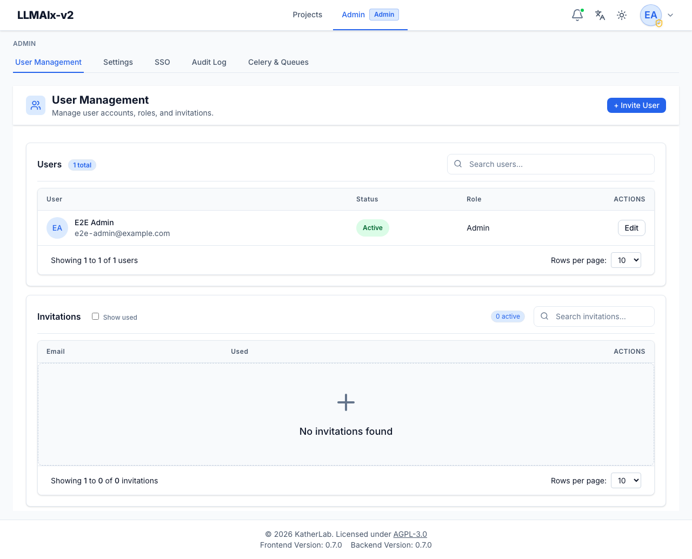

# User management

**User Management** (`/admin/user-management`) handles user accounts and
invitations. It is the default landing page for `/admin`. The page has two
cards — **Users** and **Invitations** — each with its own search box and count
badge.

<figure markdown>
  { width="820" }
  <figcaption>Users table (avatar, name/email, status, role, Edit) above the Invitations panel, with Invite User in the header.</figcaption>
</figure>

## Inviting users

**+ Invite User** (top-right) opens a modal that creates an invitation for an
email address, with an optional **Send invitation via email** toggle:

- With the toggle **on** and email configured, the app emails the invitation
  link to the address.
- With the toggle **off**, or if email delivery isn't configured, the app shows
  the invitation link (`.../register?token=…`) with a **copy** button so you can
  share it manually. A banner tells you whether the email actually went out.

The invited person opens the link, lands on the registration page with the token
pre-filled, and sets their own name and password.

The **Invitations** card lists each invitation's email and whether it's been
**used**. Used invitations are hidden by default; tick **Show used** to include
them. The count badge shows the number of still-active (unused) invitations, and
the search box filters by email. Invitations can be **deleted** (this only
removes the invite; it doesn't affect anyone who already registered with it).

## Managing users

The **Users** table shows each user's **avatar** (initials), **name and email**,
**status** (Active/Inactive), and **role** (User/Admin). The count badge shows
the total number of users and the search box filters by name or email. Columns
are sortable and the list is paginated (10/25/50 per page).

Click a user row (or **Edit**) to open the editor, which has three sections:

- **General** — **full name**, **email**, **role** (User/Admin), and **status**
  (Active/Inactive, toggled with a switch). Changes are only sent for fields you
  actually modified.
- **Set Password** — type a new password and click **Set** to reset it for that
  user (independent of the Save Changes button). Useful for onboarding or
  helping a locked-out user.
- **Danger Zone** — **Delete User**.

**Save changes** commits the General-section edits; **Set** commits a password
immediately on its own; the modal reports success or the specific error for each.

!!! warning "You can't change your own role or status"
    To prevent lockouts, an admin cannot change their own role or deactivate
    their own account from this screen — the role dropdown and the status switch
    are disabled for your own row, with a note explaining why.

!!! danger "Deleting a user cascades"
    Deleting a user permanently removes the account **and all data owned by that
    user** — their projects, files, documents, schemas, prompts, trials, and
    evaluations, plus their uploaded files in storage. A confirmation dialog
    requires you to confirm before the deletion runs.

## Roles

There are two roles:

- **User** — can create and work within their own projects.
- **Admin** — everything a user can do, plus access to the entire `/admin`
  section (settings, SSO, audit log, task monitoring, and this page).

Cross-project visibility for admins is gated separately by the
`ADMIN_ALL_PROJECT_ACCESS` environment flag; by default admins do not
automatically see other users' projects.

## Account lockout

There are two distinct mechanisms:

- **Manual** — setting a user **Inactive** blocks their login until reactivated.
  This is a deliberate administrative action you take from the editor's status
  switch.
- **Automatic** — after too many failed login attempts, an account is temporarily
  locked for a configured number of minutes and then unlocks itself. Successful
  login resets the counter. The thresholds are set by `LOGIN_MAX_ATTEMPTS` and
  `LOGIN_LOCKOUT_MINUTES`.

There is no explicit "unlock" button — either wait out the automatic lockout, or
toggle the user's status to Inactive and back to Active. Both lockouts and
account-status changes are recorded in the [audit log](../AUDIT_LOGGING.md).
