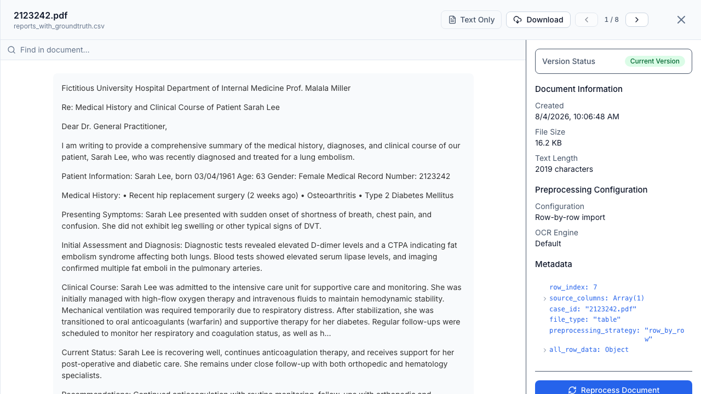
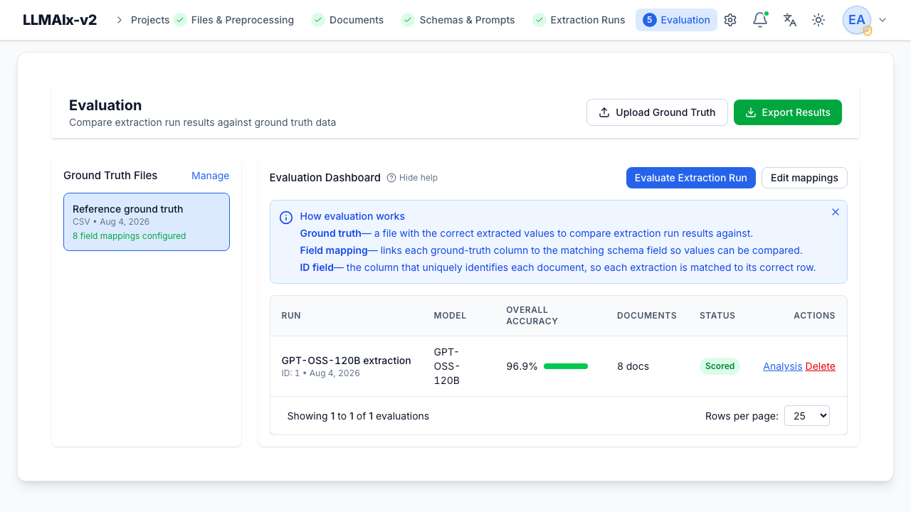

# Core concepts

LLMAIx Web organizes everything under a **project**. Within a project you move
through a fixed sequence of steps, each producing the input for the next:

```
Files → Preprocessing → Documents → Schemas + Prompts → Extraction Runs → Evaluation
```

## Project

The top-level container. A project holds its own files, documents, schemas,
prompts, extraction runs, ground truth, and evaluations. Access can be scoped per user;
admins may optionally see all projects.

## File

A raw upload — PDF, DOC/DOCX, PNG/JPEG, CSV/XLSX, or TXT. Files are stored in
local storage or S3-compatible object storage under a UUID-based filename.
Duplicate uploads are detected by SHA-256 hash. See [Files](../user-guide/files.md).

## Preprocessing

The asynchronous step that turns files into text. For PDFs and images this means
OCR / text extraction (four engines to choose from); for spreadsheets it means
converting rows or the whole table into text. See
[Preprocessing](../user-guide/preprocessing.md).

## Document

The output of preprocessing: a piece of extracted **text** ready to be sent to
an LLM. A single file can yield one document (e.g. a PDF) or many (e.g. one per
CSV row). Documents can be grouped into **document sets** for running extractions.
See [Documents](../user-guide/documents.md).

<figure markdown>
  { width="820" }
  <figcaption>A document is the extracted text (left) plus its provenance metadata (right) — the exact input an extraction run sends to the LLM.</figcaption>
</figure>

## Schema & prompt

A **schema** is a JSON schema defining the structured output you want (nested
objects, arrays, all JSON types), built with a visual tree editor. A **prompt**
pairs a system prompt (extraction rules) with a user prompt (which receives the
document text). See [Schemas & prompts](../user-guide/schemas-and-prompts.md).

## Extraction run

An **extraction run** (formerly called a "trial" — the API and database still
use the term `trial`) runs LLM extraction over a set of documents using a chosen
schema + prompt + model against any OpenAI-compatible endpoint. Each document
produces one **result** (the extracted JSON). See
[Extraction runs](../user-guide/trials.md).

## Ground truth & evaluation

**Ground truth** is a spreadsheet of known-correct values. An **evaluation**
compares an extraction run's results against ground truth — using per-field comparison
methods (exact, fuzzy, numeric, …) — and computes accuracy metrics. See
[Ground truth](../user-guide/ground-truth.md) and
[Evaluation](../user-guide/evaluation.md).

<figure markdown>
  { width="820" }
  <figcaption>An evaluation scores an extraction run against ground truth and reports overall and per-field accuracy.</figcaption>
</figure>

## Asynchronous processing

Preprocessing and extraction runs execute as background **Celery** tasks. The UI shows live
progress over a WebSocket connection, and both task types support cancellation
(with optional rollback of anything they produced).
