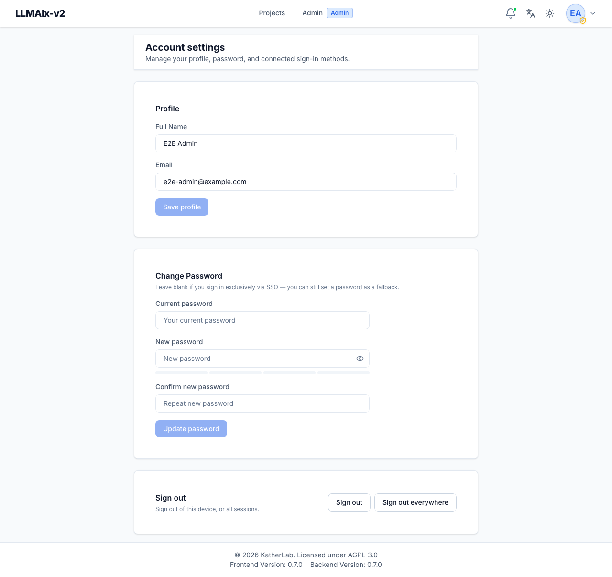

# Account settings

The **Account settings** page (`/account`) manages your profile, password, and
connected sign-in methods. Reach it from the user menu in the app header. Every
section is a self-contained card; changes in one card don't affect the others.

<figure markdown>
  { width="820" }
  <figcaption>The account settings page: profile, password change with a strength meter, connected SSO accounts, and sign-out controls.</figcaption>
</figure>

## Profile

Edit your **Full Name** and **Email**. **Save profile** is enabled only when you
have unsaved changes — that is, when either field differs from what's currently
stored on your account. After a successful save a short "Saved" confirmation
appears next to the button and the header/menu update to reflect the new name.

!!! note "Email is your login identity"
    Your email is also your sign-in username, so changing it changes the address
    you log in with. The field accepts up to 254 characters. If SSO account
    matching is configured by email, keep this in mind before changing it.

## Change password

Enter your **current password**, then a **new password** and confirmation. The
**Update password** button is enabled only when all of the following are true:

- the **current password** field is filled in,
- the **new password** is at least the minimum length (8 characters), and
- the **confirmation** matches the new password exactly.

The new-password field shows a **strength meter** as you type. If the
confirmation doesn't match, an inline error is shown and the button stays
disabled. The current-password field is required so that someone with temporary
access to an open session can't silently change your password.

!!! note "Signing out other sessions"
    Changing your password signs you out of your other sessions. If you sign in
    exclusively via SSO you can leave this blank — but you may still set a
    password as a fallback way to log in.

!!! tip "Password policy"
    The minimum length shown here is the floor. A deployment may enforce
    stronger complexity rules (uppercase, digits, symbols) via the
    `PASSWORD_POLICY_*` settings; the server rejects passwords that fail those
    rules and the reason is shown inline.

## Connected accounts (SSO)

Shown only when single sign-on is enabled for the deployment. Lists your linked
identity providers, one row each, with:

- the **provider name** (e.g. "Google", "Keycloak"),
- the **external account/subject** the link points at, and
- the **last login** timestamp through that provider (when available).

Each row has a **Disconnect** button that removes that link. Disconnecting only
severs the sign-in method — it does not delete your account or any of your data.

If you have no linked providers, the card shows an empty-state message. The whole
card is hidden entirely when SSO is disabled system-wide.

!!! warning "You can't lock yourself out"
    You cannot disconnect your last remaining sign-in method — the app blocks it
    so you always keep a way in. If SSO is your only sign-in method, set a
    password first (see [Change password](#change-password)) before
    disconnecting the provider.

## Signing out

- **Sign out** — end the session on this device only. Other devices stay signed
  in.
- **Sign out everywhere** — revoke all of your refresh tokens so every session,
  on every device, is ended. Use this if you suspect a session was compromised
  or after changing your password on a shared machine.

Both actions perform a server-side sign-out (they revoke the token on the
backend, not just clear it locally) and then return you to the login page.
