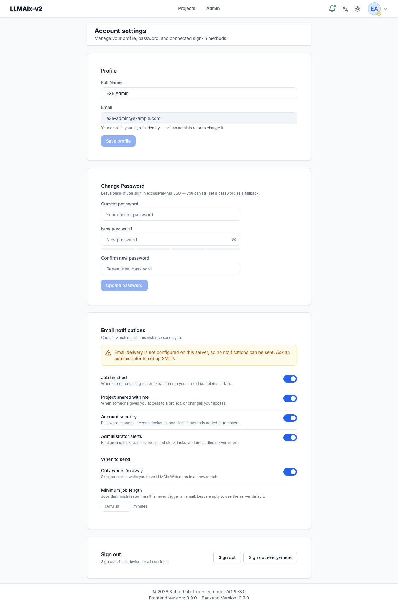

# Account settings

The **Account settings** page (`/account`) manages your profile, password, email
notifications, and connected sign-in methods. Reach it from the user menu in the
app header. Every section is a self-contained card; changes in one card don't
affect the others.

<figure markdown>
  { width="820" }
  <figcaption>The account settings page: profile, password change with a strength meter, email-notification toggles, connected SSO accounts, and sign-out controls.</figcaption>
</figure>

## Profile

Edit your **Full Name**. **Save profile** is enabled only when the name differs
from what's currently stored on your account and isn't empty. After a successful
save a short "Saved" confirmation appears next to the button and the header/menu
update to reflect the new name.

Your **Email** is shown but cannot be edited here.

!!! note "Email is your login identity"
    Your email is also your sign-in username — and, when SSO links accounts by
    email, it decides which account an external identity attaches to. Changing it
    is therefore an administrator action: ask an admin to change it from
    [User management](../admin/user-management.md). The server enforces this, not
    just the greyed-out field.

## Change password

Enter your **current password**, then a **new password** and confirmation. The
**Update password** button is enabled only when all of the following are true:

- the **current password** field is filled in,
- the **new password** is at least the minimum length (8 characters), and
- the **confirmation** matches the new password exactly.

The new-password field shows a **strength meter** as you type. If the
confirmation doesn't match, an inline error is shown and the button stays
disabled. The current-password field is required so that someone with temporary
access to an open session can't silently change your password.

!!! note "Signing out other sessions"
    Changing your password signs you out of your other sessions. If you sign in
    exclusively via SSO you can leave this blank — but you may still set a
    password as a fallback way to log in.

!!! tip "Password policy"
    The minimum length shown here is the floor. A deployment may enforce
    stronger complexity rules (uppercase, digits, symbols) via the
    `PASSWORD_POLICY_*` settings; the server rejects passwords that fail those
    rules and the reason is shown inline.

## Email notifications

Choose which emails the instance sends you. Each toggle saves immediately — there
is no Save button for this card. If your deployment has no SMTP server
configured, a banner says so and none of the toggles will have any effect until
an administrator sets one up (see
[System settings](../admin/settings.md#email-notifications)).

| Category | Sent when |
| --- | --- |
| **Job finished** | A preprocessing run or extraction run **you started** completes or fails. Not sent to other members of the project. |
| **Project shared with me** | Someone gives you access to a project, or changes the access you have. Not sent when access is revoked. |
| **Account security** | Your password is changed or reset, your account is locked after failed sign-in attempts, or a sign-in method is linked to or removed from your account. |
| **Administrator alerts** | Admins only: a background task crashed, stuck tasks were reclaimed, or the server hit an unhandled error. |

### When to send

Two settings apply to **job** email only — a security notice or a share grant is
always worth an email, even if you are looking at the app.

- **Only when I'm away** — skip job email while you have LLMAIx Web open in a
  browser tab. Your open tab sends a heartbeat every 45 seconds; if the browser
  goes away without closing cleanly (a suspended laptop, a dropped network) you
  count as present for up to two more minutes, so a job finishing in that window
  may not email you. This option needs Redis; without it you always count as
  away.
- **Minimum job length** — jobs that finish faster than this never email you.
  Leave it empty to use the server's default (2 minutes unless an administrator
  changed it).

!!! note "What the emails contain"
    Notification email carries counts, timings, the model name, and the labels
    you chose yourself — the project name and the run name. It never contains
    document text, extracted values, file names, or per-document error messages;
    those stay behind the link, which requires you to sign in. Because project
    and run names *do* travel by email, avoid putting patient identifiers in
    them.

Emails are written in the language you last selected with the language switcher.

## Connected accounts (SSO)

Shown only when single sign-on is enabled for the deployment. Lists your linked
identity providers, one row each, with:

- the **provider name** (e.g. "Google", "Keycloak"),
- the **external account/subject** the link points at, and
- the **last login** timestamp through that provider (when available).

Each row has a **Disconnect** button that removes that link. Disconnecting only
severs the sign-in method — it does not delete your account or any of your data.

If you have no linked providers, the card shows an empty-state message. The whole
card is hidden entirely when SSO is disabled system-wide.

!!! warning "You can't lock yourself out"
    You cannot disconnect your last remaining sign-in method — the app blocks it
    so you always keep a way in. If SSO is your only sign-in method, set a
    password first (see [Change password](#change-password)) before
    disconnecting the provider.

## Signing out

- **Sign out** — end the session on this device only. Other devices stay signed
  in.
- **Sign out everywhere** — revoke all of your refresh tokens so every session,
  on every device, is ended. Use this if you suspect a session was compromised
  or after changing your password on a shared machine.

Both actions perform a server-side sign-out (they revoke the token on the
backend, not just clear it locally) and then return you to the login page.
