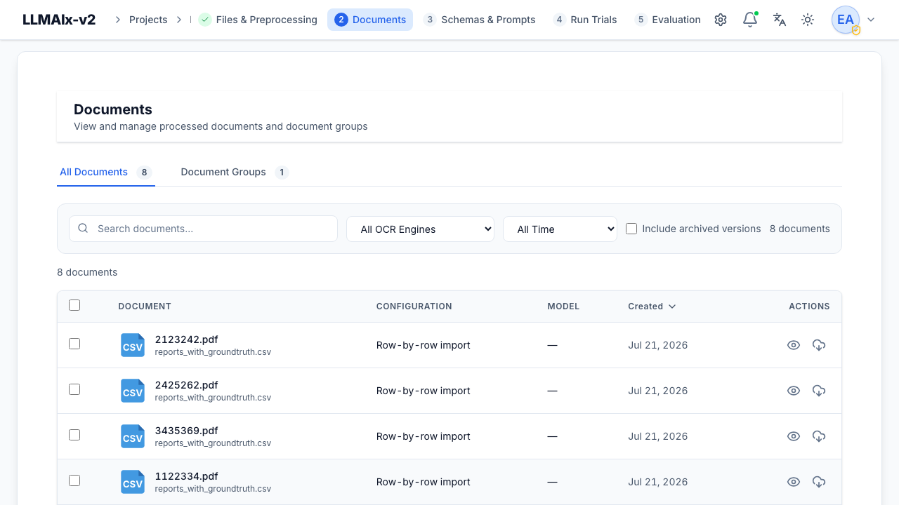
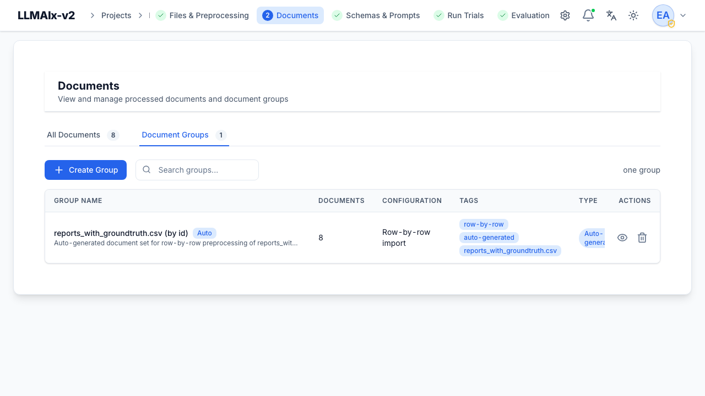

# Documents

**Documents** are the text outputs of [preprocessing](preprocessing.md) — the
content that gets sent to the LLM. This tab is for browsing, organizing, and
reprocessing them; you don't upload here.

The tab has two sub-tabs: **All Documents** and **Document Groups**.

## Finding documents

The filter bar sits above the table and combines a search box, inline filter
dropdowns, and a row of removable filter chips summarizing what's currently
applied.

- **Search** — matches document text, document name, **and** the original
  filename together. The count next to the bar reflects the filtered total.
- **OCR Engine** — *All OCR Engines* (default), *Embedded Text (pypdf)*, *Local
  OCR (Tesseract)*, *Mistral OCR*, *Vision LLM*. Changing it refetches
  immediately.
- **Date Range** — *All time* (default), *Today*, *Yesterday*, *This Week*,
  *This Month*, or *Custom*. Picking **Custom** reveals *From / To* date inputs
  and an **Apply** button — the custom range is only fetched when you click
  **Apply** (not on every keystroke), since a range means touching both fields.
- **Include archived versions** — also show non-latest document versions (their
  history). While on, a *showing history* hint appears next to the label.

Each active filter also appears as a coloured **chip** (search, OCR engine,
date, archived). Click a chip to clear just that filter, or use **Clear all** to
reset every filter at once.

<figure markdown>
  { width="820" }
  <figcaption>The All Documents view: search and OCR/date filters, the Document/Configuration/Model/Created columns, and per-row view and download actions.</figcaption>
</figure>

## The documents table

Columns:

- **Document** — a file-type icon plus the document name (falls back to the
  original filename, then to *Document #<id>*). A sub-line shows the original
  filename when it differs from the document name, otherwise the file size.
- **Configuration** — the preprocessing config name (or *Custom configuration*),
  with an OCR-method sub-line. The sub-line is shown only when OCR was actually
  applied — embedded-text extraction, plain-text files, and CSV/XLSX imports
  show nothing here.
- **Model** — the OCR/vision model recorded in the document metadata
  (`mistral_model`, `vision_model`, or a generic `model`), or `—` for local OCR
  where no model applies.
- **Created** — the **only** sortable column (the list endpoint orders solely by
  creation time; click the header to toggle ascending/descending).

Each row has **View** (eye) and **Download** (cloud) actions. Select documents
with the checkboxes; the header's **Select all documents** extends the selection
to every match across **all pages** (a brief busy state runs while the full id
list is fetched). The page-size selector and pager sit at the bottom of the
table.

## Batch actions

Selecting one or more documents opens the batch-actions modal for the chosen
verb. Every batch action shows the selection count in its header, and long-
running batches show a live *"X of Y"* progress counter in the footer (the modal
cannot be dismissed while a delete is in flight).

- **Create Group** — bundle the selection into a [document group](#document-groups).
- **Reprocess** — re-run preprocessing. An optional **Force reprocess (ignore
  existing results)** checkbox forces a fresh run even where results already
  exist.
- **Delete** — remove documents (with an optional cascade; see below).
- **Export** — *coming soon*. The control accepts a format (JSON, CSV, TXT, PDF)
  and *include metadata* / *include preprocessing info* toggles, but the export
  itself is not yet implemented and currently only shows a notice.

!!! warning "Reprocess works on whole files, not rows"
    Reprocessing runs on the **source file**, not individual rows. Each selected
    document is resolved back to its `original_file_id` (deduplicated — a
    row-by-row CSV/XLSX shares one file), so selecting a few rows reprocesses the
    **entire file** (all rows). The original preprocessing configuration is
    reused, so the rerun keeps the same OCR engine and settings rather than
    silently falling back to defaults. Mixed selections are grouped by
    configuration into separate reprocessing tasks — one task per config.

!!! danger "Delete cascade"
    Deleting a document that's referenced by a trial, group, or evaluation
    requires confirming a **cascade** that also removes those dependents. When
    you tick the cascade option the dialog fetches and previews the exact impact
    (e.g. *"3 documents, 2 trials, 1 group, 5 extraction results"*). You must
    also tick *"I understand that this action is permanent."* before the delete
    button enables. Very large selections (over ~1,000 ids) skip the preview and
    say so; deletions are sent to the backend in chunks and a per-item summary of
    any failures is surfaced afterwards.

## The document viewer

**View** opens a slide-over. Its header shows the document name (with the
original filename beneath when they differ) and an **extraction-method badge**
(Text Extraction, Local OCR, Force OCR, Mistral OCR, Vision LLM) indicating how
the text was produced.

<figure markdown>
  { width="820" }
  <figcaption>The document viewer: extracted text with Find-in-document on the left, and a sidebar with version status, document information, preprocessing configuration, a metadata tree, and a Reprocess Document button.</figcaption>
</figure>

Depending on the source, a segmented control lets you switch view mode:

- **Text** — the extracted text, rendered as Markdown, with a
  **find-in-document** bar (Enter = next match, Shift+Enter = previous, Esc =
  clear).
- **File** — the original PDF or image preview.
- **Both** — original and text side by side (the default when a displayable
  original file exists).

Documents whose text *is* the content — plain-text (`text/plain`) files and
row-by-row spreadsheet rows — have no separate original to show, so instead of
the segmented control the header shows a **Text Only** pill.

Additional header controls:

- **Download** — downloads the currently viewed document.
- **History** — appears only when the document has version history; the button
  carries a badge with the version count (see below).
- **Navigation** — when the viewer is opened from a list, header **‹ / ›**
  arrows and a **1 / N** pager move through the whole corpus. The **← / →** keys
  do the same (ignored while focus is in a text field so you can still type).

### The info sidebar

The right-hand sidebar summarizes the current document (or the selected
version):

- **Version Status** — a *Current Version* / *Archived Version* pill.
- **Document Information** — created date, original file size, and the text
  length in characters (plus an *archived* timestamp for non-current versions).
- **Preprocessing Configuration** — the config name (or *Custom*), the OCR
  engine, and the model where one applies.
- **Metadata** — the raw document metadata rendered as an interactive JSON tree.
- **Actions** — **Reprocess Document**, plus **Restore This Version** when an
  archived version is selected.

### Version history

If a document was reprocessed, the **History** button opens the version
sidebar. Each version is labelled `v1`, `v2`, … and marked **Current** or
**Archived**. Click a version to view its text and metadata in place;
**Restore This Version** makes an archived version current again.

!!! note "Restore never reprocesses"
    Restoring copies the archived version's exact text into a new latest
    version — nothing is re-OCR'd or re-extracted.

## Document groups

A **document group** (a *document set* in the API) is a named set of documents
you can run a [trial](trials.md) against. Groups can be:

- **Manual** — created via **Create Group** (from the batch bar or the Groups
  tab).
- **Auto-generated** — created during preprocessing (e.g. one group per
  row-by-row spreadsheet import, so all rows from one file stay together),
  marked with an **Auto** badge.

<figure markdown>
  { width="820" }
  <figcaption>The Document Groups view: an auto-generated group carrying the Auto badge, with its document count, configuration, tags, and type, alongside the Create Group action.</figcaption>
</figure>

The Groups sub-tab has its own **Create Group** button and a search box (which
searches server-side, debounced). The table shows:

- **Name** — with the **Auto** badge on auto-generated groups and an optional
  description sub-line.
- **Documents** — the group's document count.
- **Configuration** — the shared preprocessing config, or *Mixed* when the
  members span multiple configs.
- **Tags** — up to five tag chips, with a *+N* overflow chip beyond that.
- **Type** — an *Auto* or *Manual* pill.
- **Created** — creation date.

Row actions are **View**, **Edit** (manual groups only — auto groups have no
edit action), and **Delete**.

!!! note "Groups in use can't be deleted"
    A group referenced by a trial cannot be deleted — its delete action is
    disabled with an explanatory tooltip. When you do delete a deletable group,
    the confirmation offers an **also delete its documents** checkbox; ticking it
    removes member documents too, but only where they aren't referenced
    elsewhere (documents still in use are kept, and you're told when that
    happens).

## Next step

Define what to extract in **[Schemas & prompts](schemas-and-prompts.md)**.
