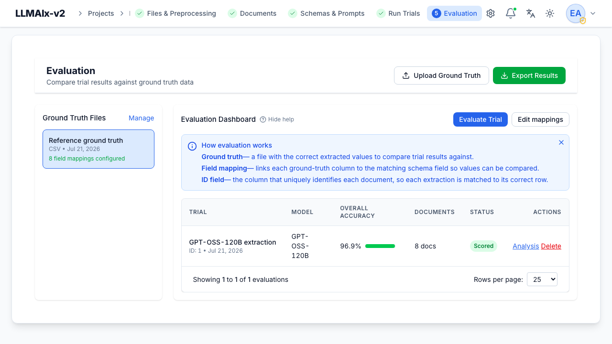
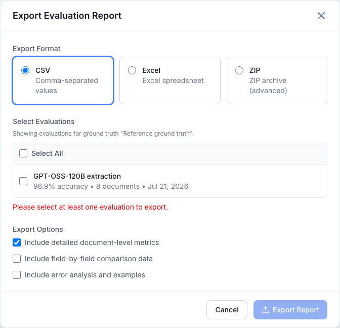

# Evaluation

An **evaluation** compares a completed trial's results against
[ground truth](ground-truth.md) and computes accuracy metrics. This is how you
measure and debug extraction quality.

## Creating an evaluation

An evaluation is the combination of **a trial + a ground-truth file + field
mappings**. From the Evaluation dashboard:

1. Select a ground-truth file that has **field mappings** configured.
2. Click **Evaluate Trial** and pick a **completed** trial from the list.

Trials without mappings for their schema (or with no results) are greyed out.
Already-evaluated trials are marked, and re-evaluating asks for confirmation.

<figure markdown>
  { width="820" }
  <figcaption>The Evaluation dashboard: the ground-truth file list, the evaluations table (trial, model, overall accuracy, documents, status, and Analysis/Delete), the Upload Ground Truth / Export Results buttons, and the "How evaluation works" explainer.</figcaption>
</figure>

!!! note "Only matched documents are scored"
    Documents whose identifier can't be matched to a ground-truth entry are
    reported separately and **excluded** from the accuracy figure. If a trial has
    a low match rate you'll get a warning listing the unmatched documents. A
    match rate below 80% (or below 50%) is surfaced as a warning, but evaluation
    still runs on the documents that did match.

Evaluations are **auto-invalidated** and recomputed when their inputs change —
editing the ground-truth file, its ID column, or the field mappings, or
re-running the trial. A cached evaluation is reused only while the trial's
results haven't changed since it was computed.

## The evaluations table

Each row shows the trial, model, **overall accuracy** (with a colored bar:
**green ≥90%**, **yellow 50–90%**, **red <50%**), the document count (and how many
matched, with an unmatched-count tooltip when some are excluded), and a status
(**Scored** or **Has Errors**). Rows have **Analysis** and **Delete**.

The **"How evaluation works"** callout stays visible until mappings exist, to
guide first-time setup.

!!! note
    Deleting an evaluation keeps the trial and ground truth — you can re-evaluate
    anytime.

## Metrics explained

- **Accuracy** = correct fields ÷ total fields, over matched documents only.
- **Precision / Recall / F1** are computed from per-field outcomes:
    - A correct field is a true positive.
    - A **missing** field (ground truth present, prediction absent) counts as a
      false negative.
    - An **extra** field (prediction present, ground truth absent) counts as a
      false positive.
    - A **wrong value** (a substitution — the model produced a value where the
      ground truth also had one, but it was wrong) counts as **both** a false
      positive and a false negative.

!!! info "Why a wrong value hurts twice"
    Counting a substitution as both FP and FN is the standard information-
    extraction (MUC) convention. It means a set of fully-wrong-but-present values
    does **not** score 100% recall. Every mismatch, type error, or unparseable
    date is treated as a substitution.

Precision, recall, and F1 are reported both overall and per field, so a field
can look accurate yet still show a recall dent if the model tends to skip it.

## Analysis page

**Analysis** opens a detailed view.

<figure markdown>
  { width="820" }
  <figcaption>The Analysis view: overall Accuracy / Precision / Recall / F1 with the matched-field count, per-field accuracy sorted worst-first (categorical fields carry a CAT badge), and a per-document table with OK / Partial status and wrong-of-total counts.</figcaption>
</figure>

- **Overall metrics** cards (accuracy, precision, recall, F1), with a note on how
  many fields/documents were matched vs. excluded.
- **Fields** list — sortable **Worst first** (default, to surface problem fields)
  or **A→Z**, each with its accuracy and error count. Categorical/boolean fields
  carry a **CAT** badge. Click a field to filter the document table to it and
  (for categorical fields) show its **confusion matrix**.
- **Filter bar** — search documents and filter by status: *All*, *Failed* (didn't
  score), *Has wrong values*, *Has missing fields*, *High ≥90%*, *Low <50%*.
- **Confusion matrix** (categorical/boolean fields) — expected rows × predicted
  columns; click a cell to filter the document table to that expected→predicted
  case. A confusion matrix is only built for discrete-valued fields (mapped as
  **category** or **boolean**), never for free text.
- **Document table** — per-document accuracy, wrong/total counts, and a status
  tier — **OK** (≥90%), **Partial** (50–90%), **Low** (<50%), or **Error** (a
  document that couldn't be scored). Click a row for the failure detail.

### Per-document failure detail

The failure drawer shows, for one document, up to three panels (navigate with
**←/→** or **J/K**, close with **Esc**):

- **Source** — the original file or extracted text.
- **Comparison** — a field-by-field *Expected vs. Predicted* table with the error
  type, a suggestion, and the comparison-method chip (plus threshold/tolerance)
  that judged the field.
- **Output** — the raw structured result.
- **Reasoning** — the model's reasoning, when present.

## Exporting

**Export Results** (or **Export** from the analysis page) opens the export
dialog.

<figure markdown>
  { width="720" }
  <figcaption>The Export Evaluation Report modal: choose CSV, Excel, or ZIP, select one or more evaluations, and toggle which content to include.</figcaption>
</figure>

- **Format** — **CSV**, **Excel (xlsx)**, or **ZIP** (advanced).
- **Select Evaluations** — one or more (the evaluation you launched from is
  pre-selected); a **Select all** toggle and a per-file scoping note are shown.
- **Options**:
    - **Document-level metrics** (on by default) — one row per document.
    - **Field-by-field data** — the expected/predicted detail for every field.
    - **Error analysis** — the breakdown of error types.
    - **ZIP only:** include **document content** and/or **ground-truth content**
      in the archive.

A live **preview** summarizes how many evaluations and documents the export will
contain. A ZIP that bundles document or ground-truth content can be large, and a
warning appears when either is selected (no fake size estimate is shown, since the
real size depends on content the browser can't measure).

!!! note "Clinical data exports are audited"
    Exports of clinical data are recorded in the audit log.
</content>
