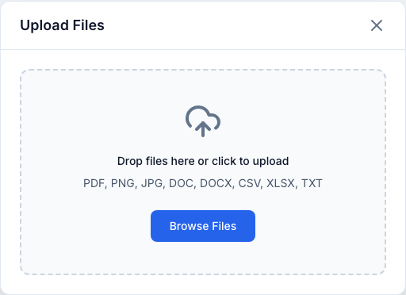
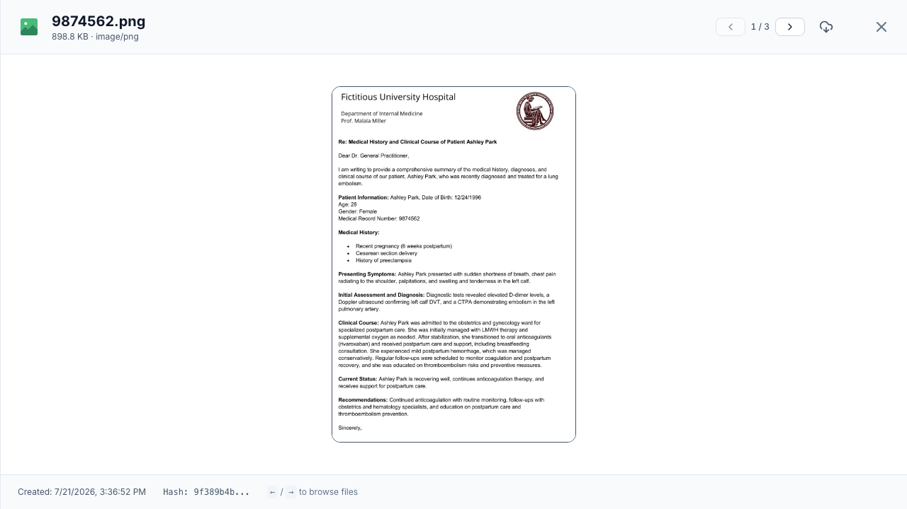
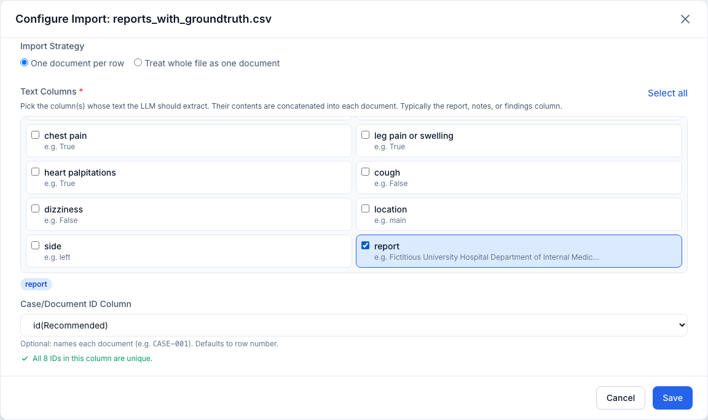

# Files

The **Files** tab is where you upload and organize the source documents for a
project. It is the entry point of the workflow — everything downstream operates
on what you upload here.

Supported types: **PDF, PNG, JPG/JPEG, DOC, DOCX, CSV, XLSX, TXT**.

<figure markdown>
  { width="820" }
  <figcaption>The Files & Preprocessing tab: each row shows type, size, upload time and status, with per-row actions and an "Upload Files" button top-right.</figcaption>
</figure>

## Uploading files

- Click **Upload Files** (top-right), or on an empty project **drag files onto
  the dropzone** or use **Browse Files**.
- You can select multiple files at once. Uploads run **one file at a time**;
  a progress panel shows *"Uploading file X of Y"*, an overall bar, and a live
  *"N succeeded · M failed"* count.
- **Cancelling** mid-batch keeps files already uploaded and skips the rest —
  you'll be asked to confirm (**Cancel uploads** / **Keep uploading**).
- If some files fail, the modal stays open with a **Failed uploads** list
  (each showing the filename and reason) so you can retry them.

<figure markdown>
  { width="620" }
  <figcaption>The Upload Files modal: drop files onto the zone or browse for them.</figcaption>
</figure>

The modal has two states:

- **Idle** — a compact **dropzone**; drop files onto it or click to browse. The
  dropzone highlights while you drag files over it.
- **Uploading / summary** — replaces the dropzone once a batch starts. It shows
  an **overall progress bar** with a running percentage, the **current file's**
  name and its own progress bar, and a live *"N succeeded"* count (plus a red
  *"· M failed"* when any file fails). On completion the overall bar turns
  **amber** if there were failures, and a **Close** button appears.

!!! note "The upload can't be dismissed by accident"
    While a batch is uploading, clicking the backdrop or pressing **Esc** does
    **not** close the modal — only the explicit **X** or **Cancel** button stops
    it. The cancel button reads *"Cancelling…"* while the loop winds down.

!!! info "Duplicate detection"
    Files are hashed (SHA-256) on upload. Uploading a file that already exists in
    the project is rejected as a duplicate — the app tells you which existing
    file it matched, rather than creating a copy.

There is a maximum file size (enforced during upload — see `MAX_UPLOAD_SIZE_BYTES`
in [Configuration](../operations/configuration.md)); oversized files are
rejected.

## Finding files

When a project has files, a filter bar appears above the table:

- **Search** — matches filenames (debounced as you type).
- **Status** — `All`, **Not Processed**, **Processing**, **Completed**,
  **Failed** (derived from each file's latest preprocessing run).
- **File Type** — PDF, PNG, JPEG, CSV, XLSX, XLS, TXT, DOC, DOCX.
- **Date Range** — Today, Yesterday, Last 7 Days, Last 30 Days, or a
  **Custom Range** (pick *From* / *To* and click **Apply**).

Active filters show as removable chips; **Clear All Filters** resets everything.

## The files table

Columns — **File**, **Type**, **Size**, **Uploaded**, **Status** — are all
sortable (default: newest first). The **File** column pairs a type icon with the
filename; a spreadsheet that still needs configuring carries a yellow
**Needs Import Config** badge here (see
[Configuring CSV / XLSX imports](#configuring-csv-xlsx-imports)).

The **Status** column reflects the file's *latest* preprocessing run and reads
as one of:

| Status | Meaning |
| --- | --- |
| **Not Processed** | Uploaded but never preprocessed yet. |
| **Processing** | A preprocessing run is currently in progress. |
| **Completed** | Preprocessing finished and produced documents. |
| **Failed** | The most recent run failed for this file. |

Each row has actions:

- :material-clock: **Preprocessing History** — see every run for this file.
- :material-eye: **Preview** — open the file preview.
- :material-download: **Download** — download the original file.
- :material-delete: **Delete** — remove the file (see [Deleting](#deleting-files)).

Select rows with the checkboxes (or the header **select-all**). Page sizes are
**25 / 50 / 100 / 250**.

!!! tip "Select all across pages"
    With a large project, the **Select all {total}** button in the info callout
    selects every file matching the current filters — across all pages — so you
    can preprocess a whole project in one go.

## Previewing files

The preview opens as a slide-over. Its header shows the file's icon, name, size
and MIME type; the footer shows the **created** date, the first eight characters
of the file's **hash**, and any description. When you open the preview from the
table (which passes the current file list), the header also gains **prev/next
buttons** and an **X / Y** position counter, and the **← / →** keys move between
files (ignored while you're typing in a field). A **Download** button is always
available.

<figure markdown>
  { width="820" }
  <figcaption>Previewing a scanned report image, with prev/next paging across the file list.</figcaption>
</figure>

Rendering depends on the type:

- **PDF** — inline viewer (embedded iframe).
- **Images** — shown directly, scaled to fit.
- **CSV/XLSX** — a table of the first 50 rows, parsed with your saved import
  settings (encoding, delimiter, header, sheet). The configured **ID column** is
  highlighted in the primary color and the **Text columns** in green, with chips
  below the table naming them; long text-column cells (over 80 characters)
  truncate with a **…more** link that opens the full value in a dialog with a
  **Copy** button. A footer line notes when only part of a larger file is shown.
- **TXT** — plain-text view.
- Other types fall back to a **Download File** button.

!!! note "Previews are lazy and never leak"
    The preview fetches content only when it opens, and re-fetches when you page
    to another file — a stale response for the previous file can't overwrite the
    one you're now viewing. Blob URLs for PDFs/images are revoked as you move on.

## Configuring CSV / XLSX imports

Spreadsheets need an **import configuration** before they can be preprocessed.
Until configured, the file shows a yellow **Needs Import Config** badge; click
**Configure** to open the import dialog. (Re-opening a configured file shows
**Edit Import Configuration** and pre-fills your saved settings.)

<figure markdown>
  { width="820" }
  <figcaption>Configuring a CSV import: row-by-row strategy with the report column picked as text and a unique id column.</figcaption>
</figure>

The dialog opens with a **preview of the first 25 rows** (re-parsed live as you
change the options below; a caption reports how many rows are shown). If the
preview can't be loaded, an inline error with **Retry** appears instead.

**Parse options**

- **Encoding** — chosen from the detected encodings (e.g. `utf-8`, `latin1`).
- **Delimiter** (CSV only) — Comma, Semicolon, or Tab.
- **File contains header row** toggle — when off, columns are labelled
  *Column 1*, *Column 2*, …
- **Sheet** selector — for XLSX workbooks with multiple sheets; defaults to the
  first sheet.

**Import strategy**

- **One document per row** (`row_by_row`) — each row becomes its own document.
- **Treat whole file as one document** (`full_document`) — the entire table
  becomes a single document.

**Row-by-row options** (shown only when *One document per row* is selected)

- **Text Columns** *(required)* — a checkbox grid of every column, each showing a
  **sample value** (from the first non-empty row) to help you recognise it. Tick
  the column(s) whose text the LLM should extract (typically the report / notes /
  findings column); their contents are concatenated into each document. A
  **Select all** shortcut ticks every column, and the current picks are echoed as
  blue chips beneath the grid. At least one column is required — otherwise Save
  is disabled and a red hint appears.
- **Case / Document ID Column** — names each document (e.g. `CASE-001`).
  Defaults to **(Row number)**. Columns whose names look like identifiers (`id`,
  `case_id`, `patient_id`, `identifier`, `studyid`, `record_id`) are auto-guessed
  as the default and flagged *(Recommended)* in the dropdown.

!!! warning "IDs must be unique"
    When you pick an ID column, the app validates it **against the whole file**
    (debounced, server-side). While it checks you'll see *"Checking uniqueness…"*
    and Save stays disabled. The result is one of:

    - **All N IDs are unique** — a green check; you're good to save.
    - **Not unique** — a red panel listing the offending values and how many
      times each appears (empty values are called out), with a count of any
      further duplicates. Duplicate or empty IDs **block saving**.
    - **Column not found** — an amber warning if the chosen column no longer
      exists under the current parse settings.

    Fix the data or fall back to **(Row number)**. This prevents documents from
    colliding or being named `nan`. As a safety net, the save endpoint
    re-validates server-side and rejects duplicates even if the live check was
    skipped.

Saving stores the configuration on the file and clears its **Needs Import
Config** badge. Closing with unsaved edits prompts you to **Discard changes** or
keep editing. When configuring several files in a batch, the dialog advances to
the next unconfigured file automatically.

## Deleting files

Delete a single file with its trash action, or several at once via the
**Delete** button in the batch bar (up to 200 at a time).

Before deleting, the dialog shows an **impact preview** — how many documents,
trials, groups, extraction results, and evaluation metrics depend on the file —
and a cascade checkbox.

!!! danger "Cascading deletes"
    - A file that is **currently being preprocessed** cannot be deleted; cancel
      the preprocessing run first.
    - A file **linked to documents** requires confirming the cascade, which also
      removes dependent trials, groups, and evaluation data. This is
      irreversible — take a [backup](../operations/backup-restore.md) if unsure.

## Batch actions

Selecting one or more files reveals a floating action bar:

- A **"N needs config"** warning if any selected spreadsheet lacks import config.
- **Configure Preprocessing** (or **Configure Files First** if configuration is
  still needed) — see [Preprocessing](preprocessing.md).
- **Delete** and **Clear** selection.

## Next step

Once your files are uploaded (and any spreadsheets configured), select them and
move on to **[Preprocessing](preprocessing.md)** to extract their text.
