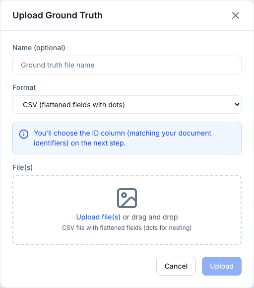
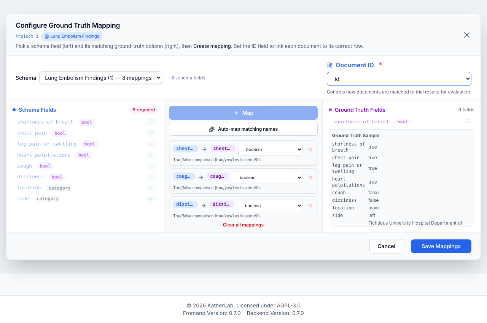
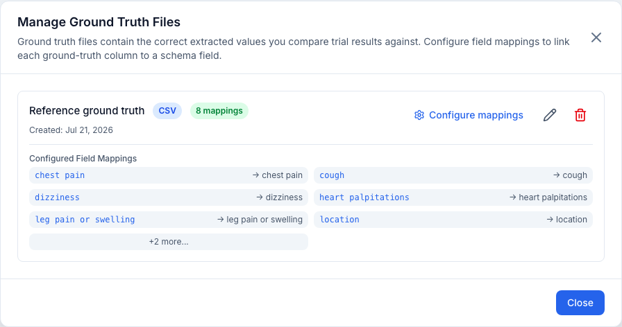

# Ground truth

**Ground truth** is a file of known-correct values used to measure a trial's
accuracy. You upload it, tell the app how documents are identified, and map each
ground-truth column to a schema field. Ground truth is managed inside the
**Evaluation** tab.

## Uploading

**Upload Ground Truth** accepts four formats:

- **CSV** — flattened fields; dot notation (`contact.email`) builds nesting.
- **JSON** — a single file with a document map, or multiple files (each document
  needs an `id` matching your document identifiers).
- **ZIP** — multiple JSON files (one document per file; a file's `id` field, or
  its filename stem, becomes the key).
- **Excel (.xlsx)** — dot-paths build nesting; multiple sheets are merged by ID
  (the same ID across sheets is deep-merged into one record).

Give it an optional **name**. Dropping a file auto-selects the matching format;
dropping several JSON files zips them together automatically. After upload, the
app opens the mapping configurator right away.

<figure markdown>
  { width="720" }
  <figcaption>The Upload Ground Truth modal — drop or pick a CSV, JSON, ZIP, or Excel file and give it an optional name.</figcaption>
</figure>

!!! info "How documents are matched"
    Ground-truth entries are matched to trial results by identifier. For
    JSON/ZIP each entry needs an `id`; for CSV/XLSX you choose the **ID column**
    in the next step. Matching is **case-insensitive** and tries, in order: the
    document name (with and without file extension), the source filename (with
    and without extension and folder path), and finally the document's numeric
    ID (also as `doc_<id>` / `document_<id>`).

!!! warning "IDs must be unique and present"
    Every CSV/Excel row that carries data must have a value in the ID column, and
    IDs must be unique within a table. Rows with data but no ID, or duplicate
    IDs, cause the upload to fail with an explicit error rather than silently
    dropping or overwriting rows. Fully empty rows are ignored. Numeric IDs are
    normalized (e.g. `123.0` → `123`) so they line up with document names.

## Selecting the ID field

In the mapping dialog:

- **CSV/XLSX** — pick the **Document ID** column (required; it must match your
  document identifiers). Choosing a column that doesn't exist in the file is
  rejected loudly; the app never silently falls back to row numbers.
- **JSON/ZIP** — use the document **filename**, or a **field** from the data.

!!! warning "Changing the ID field invalidates evaluations"
    Changing the ID column clears cached data and **invalidates existing
    evaluations** that used this ground truth, so they are recomputed with the
    new key.

## Mapping fields

The full-screen **Configure Ground Truth Mapping** dialog has three columns:

- **Left — Schema fields** — pick the schema; its fields show as a tree with type
  badges. Required, unmapped leaves are flagged; mapped leaves get a check.
- **Center — Mappings** — create each mapping (schema field → ground-truth
  field). **Auto-map matching names** maps fields whose normalized names match.
  **Clear all mappings** resets them.
- **Right — Ground-truth fields** — the parsed columns/fields plus a live data
  **Ground Truth Sample** so you can eyeball the real values as you map.

<figure markdown>
  { width="820" }
  <figcaption>The mapping configurator: schema fields (left) mapped to ground-truth columns (right), each mapping with its own comparison-method dropdown, plus Auto-map, the Document ID selector, and a live Ground Truth Sample.</figcaption>
</figure>

Each mapping row shows the schema field (with type), an arrow, the ground-truth
field (with type), a **comparison-method** dropdown, an options button for
methods that have tunable settings, and a remove button. Saving persists the ID
column (if changed) and the mappings. You can't save until a schema is chosen, at
least one mapping exists, and the ID field is set.

!!! warning "Editing mappings invalidates evaluations"
    Saving new mappings deletes evaluations for trials using that schema, so they
    can be recomputed against the new mapping.

## Comparison methods

Each mapping has a **comparison method**, defaulted from the field type. A short
description of the selected method is shown under each row. Pick the one that fits
the field:

| Method | Correct when… | Tunable options |
| --- | --- | --- |
| **exact** | strings are equal, ignoring case and surrounding whitespace | *(none in the mapping row)* |
| **fuzzy** | similarity ≥ a threshold | **threshold** (default 85; higher is stricter), **allow partial match** |
| **numeric** | values within a tolerance | **tolerance** (default 0.001), **relative** toggle |
| **boolean** | both parse to the same true/false | *(none)* |
| **category** | category labels match | *(synonym mappings, applied by the engine)* |
| **date** | calendar dates are equal | *(none)* |

Only **fuzzy** and **numeric** expose an inline options panel (the sliders icon);
the other methods have no per-row settings.

**How each method scores a value:**

- **exact** — compares the two values as strings after trimming and (by default)
  lower-casing. Use it for IDs, codes, and enum-like labels.
- **fuzzy** — the score is `max(ratio, token_sort_ratio)`, so it tolerates typos
  and reordered words (*"chest pain"* vs *"pain chest"*) without rewarding a bare
  substring. Enabling **allow partial match** additionally considers
  `partial_ratio`.
- **numeric** — parses both sides as numbers. With **relative** off, it passes
  when the absolute difference is within tolerance; with **relative** on, it
  passes when the difference *as a fraction of the expected value* is within
  tolerance (so `0.05` ≈ 5%). A value that isn't numeric is a type error.
- **boolean** — recognizes `true/yes/1/y/t/on` and `false/no/0/n/f/off`
  (case-insensitive). A token it can't recognize (e.g. *"maybe"*) is a **type
  error**, not a silent `false` — so genuine ambiguity is surfaced.
- **category** — matches labels case-insensitively, optionally via synonym
  mappings, and **builds a confusion matrix** for the field (see
  [evaluation](evaluation.md#analysis-page)).
- **date** — parses many common formats (`YYYY-MM-DD`, `DD/MM/YYYY`,
  `MM/DD/YYYY`, `DD.MM.YYYY`, …, with a pandas fallback) and compares the
  resulting calendar dates.

Arrays are compared **order-independently** (set semantics): every expected
element must be matched by a distinct predicted element with no extras, and each
element is scored with the row's comparison method (so numeric tolerance / fuzzy
thresholds still apply per item). Both a *missing* expected element and an
*extra* predicted element make the field wrong.

!!! warning "Fuzzy substring matching is off by default"
    Substring matching is opt-in because it can invert meaning in medical text
    (e.g. *"cancer"* matching *"non-cancer"*). Enable it only when you're sure.

The dialog also shows amber **hints** when a comparison method is unusual for a
field's type, or when the schema and ground-truth types don't line up.

## Managing ground-truth files

The **Manage Ground Truth Files** view lists each file with its format, mapping
count, and a preview of its mappings. You can **Configure mappings**, **Rename**,
or **Delete**.

<figure markdown>
  { width="720" }
  <figcaption>The Manage Ground Truth Files modal: each uploaded file shows its mapping count with Configure mappings, Rename, and Delete actions.</figcaption>
</figure>

!!! danger
    Deleting a ground-truth file also deletes all **evaluations** that used it.

## Next step

With mappings configured, create an **[evaluation](evaluation.md)**.
</content>
