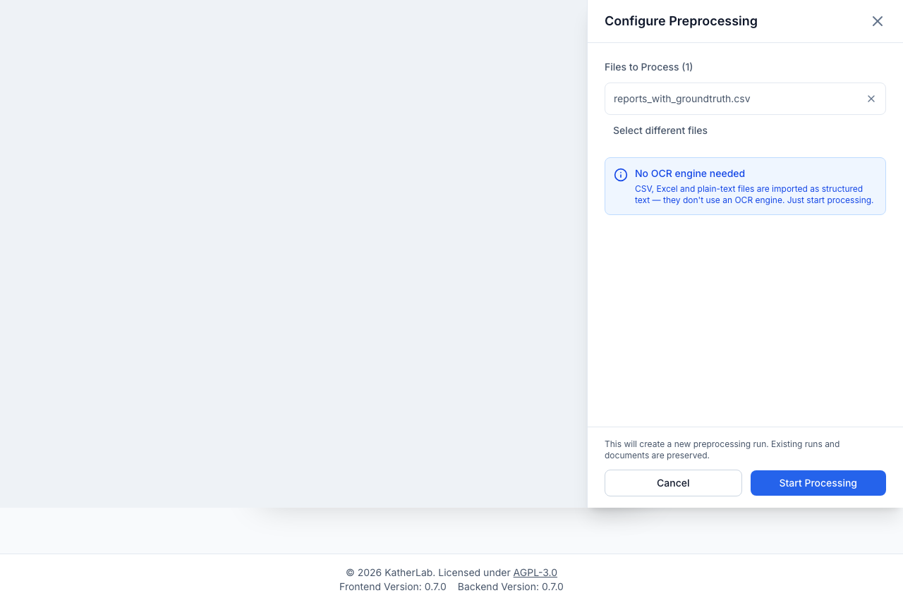

# Preprocessing

**Preprocessing** turns your uploaded files into plain **text** that an LLM can
read. For PDFs and images this means OCR / text extraction; for spreadsheets it
converts rows or the whole table into text.

!!! note "Not a separate tab"
    Preprocessing is driven from the **Files** tab: select the files you want to
    process, then open the configuration panel from the batch action bar. Each
    file's runs and results are tracked in its **Preprocessing History**.

## The configuration panel

**Configure Preprocessing** opens a right-hand slide-over. At the top it lists
the **files to process**, each with an **X** to drop it from the batch, plus a
**Select different files** link that clears the selection and closes the panel so
you can re-pick. Below that sit the engine choice, options, and a **Start
Processing** footer.

<figure markdown>
  { width="620" }
  <figcaption>The Configure Preprocessing panel: what it shows depends on whether the selection contains files that need OCR.</figcaption>
</figure>

## Choosing an OCR engine

When your selection contains files that need OCR (PDFs and images), pick one of
the engines your administrator has enabled. Each appears as a selectable card
with an icon, a display name, and a short subtitle; the picked card is
highlighted. Only enabled engines are shown, and the first enabled one is
pre-selected. For a detailed description of each engine and when to use it, see
**[OCR engines](ocr-engines.md)**.

| Engine | Best for | Notes |
| --- | --- | --- |
| **Quick (Local OCR)** | Everyday scans, no API needed | Docling / Tesseract, runs locally. |
| **Mistral OCR** | Complex layouts | API-based (hosted Mistral or self-hosted DeepSeek-OCR-2). |
| **Vision LLM** | Complex / difficult documents | Any OpenAI-compatible vision model. |

!!! info "Text-only files need no OCR"
    CSV, XLSX, and TXT files are imported as structured text and never touch an
    OCR engine. If your selection is **only** text/table files, the panel hides
    the engine cards and shows a *"No OCR engine needed"* notice — you can start
    immediately. The moment the selection also contains a PDF or image, the
    engine chooser reappears. (A file whose type is unknown is treated as
    OCR-requiring, to be safe.)

If your selection needs OCR but **no engine is enabled**, the panel shows a red
*"OCR required"* callout, blocks the run, and tells you to enable one in
[system settings](../admin/settings.md).

!!! warning "Configure spreadsheets first"
    If any selected CSV/XLSX file still lacks an import configuration, a warning
    callout lists them and the **Start Processing** button is disabled until they
    are [configured](files.md#configuring-csv-xlsx-imports).

## Options

- **Force OCR for PDFs** — an amber toggle that skips embedded-text extraction
  and OCRs every page. Useful when a PDF's embedded text is wrong or missing.
  Only shown when the selection contains PDFs **and** an engine is enabled.
- **Vision prompt** — when **Vision LLM** is the selected engine, a text box lets
  you set the instruction sent to the vision model. It defaults to
  *"Extract all text from this image and return it as clean markdown."*
- **Advanced options** — a collapsible section (reset to collapsed each time the
  panel opens) with per-engine overrides:
    - *Local OCR* — **Tesseract Language**: **Auto-detect** by default, or pick a
      specific language (English, German, French, Spanish, Italian, Portuguese,
      Dutch, Polish, Russian, Simplified Chinese, or Latin). A specific choice is
      sent as the Docling OCR language; *Auto-detect* sends nothing.
    - *Mistral OCR* — **API Key** and **Model** overrides. Leave empty to use the
      server defaults (the model placeholder is `mistral-ocr-latest`).
    - *Vision LLM* — **API Key**, **Base URL** (e.g. `https://api.openai.com/v1`),
      **Model**, and a **Max image dimension** (400–4096 px). Leave the key,
      base URL, and model empty to use the server defaults.

!!! note "Overrides are per-run and optional"
    Every advanced field left blank falls back to the administrator's server
    configuration. Values you enter apply only to this preprocessing run and are
    not saved as a preset.

!!! tip "Embedded text is reused"
    For a PDF that already contains selectable text, that text is extracted
    directly and the result is identical regardless of the OCR engine — unless
    you enable **Force OCR**. See the embedded-text threshold under
    [OCR engines](ocr-engines.md#force-ocr).

## Starting a run

The panel footer carries a short reassurance note and two buttons: **Cancel**
and **Start Processing**. **Start Processing** stays disabled until the selection
is valid — files are selected, any spreadsheets are configured, and (for an
OCR-requiring selection) an enabled engine is picked. It also shows a loading
state and reads *"Processing…"* while the run is being dispatched.

Click **Start Processing**. Before dispatching, the app may show a preview
dialog if it detects:

- **PDFs with embedded text** — informs you the text will be extracted directly.
- **Existing documents with the same configuration** — running again creates new
  **versions** and archives the old ones. You can tick **Only process files
  without existing documents** to skip already-processed files.
- **Existing documents with a different configuration** — both versions are kept
  side by side.

Each run is additive: *"Existing runs and documents are preserved."*

## Progress, cancellation, and completion

- A global banner shows **"Preprocessing — X of Y files · Z failed"** with a
  progress bar and an ETA. Progress updates live.
- **Cancel** stops the run; files still in progress are marked failed. You'll be
  asked to confirm.
- When the last run finishes, a completion callout summarizes
  **"N documents created · M files failed"** with **View errors** and
  **View documents** shortcuts.

## Preprocessing history

Each file's :material-clock: **Preprocessing History** slide-over lists every
run (engine, start time, duration, status) with:

- A live progress bar for active runs.
- A **per-file breakdown** with processing time and, on failure, a **View
  error** expander.
- **Warnings** — e.g. *"N skipped rows"* for row-by-row imports where the
  selected text columns were empty (each skipped row is listed with a reason).
- Links to the resulting **documents** or **group**.
- **Retry failed files**, **Cancel** (active runs), and **Run new
  preprocessing** actions.

## Non-obvious behaviors

- File **status** reflects each file's own subtask — so if one file in a batch
  fails, the others still show their true status.
- Spreadsheets must be [import-configured](files.md#configuring-csv-xlsx-imports)
  before they can be preprocessed; the UI blocks and guides you through it.
- Row-by-row imports skip rows whose selected text columns are all empty, and
  report them as warnings rather than failing the whole file.

## Next step

The text this step produces becomes your **[Documents](documents.md)**.
