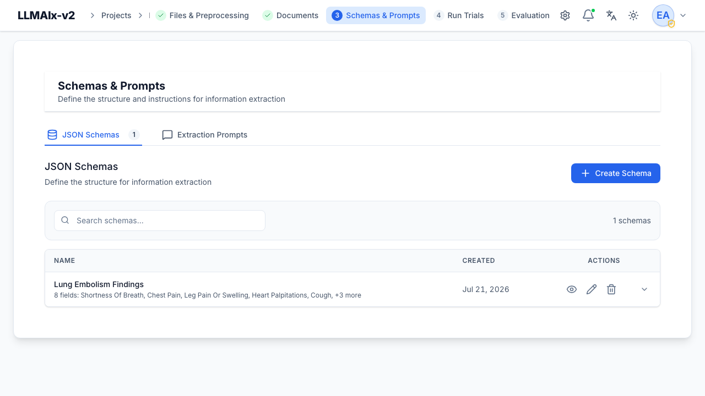
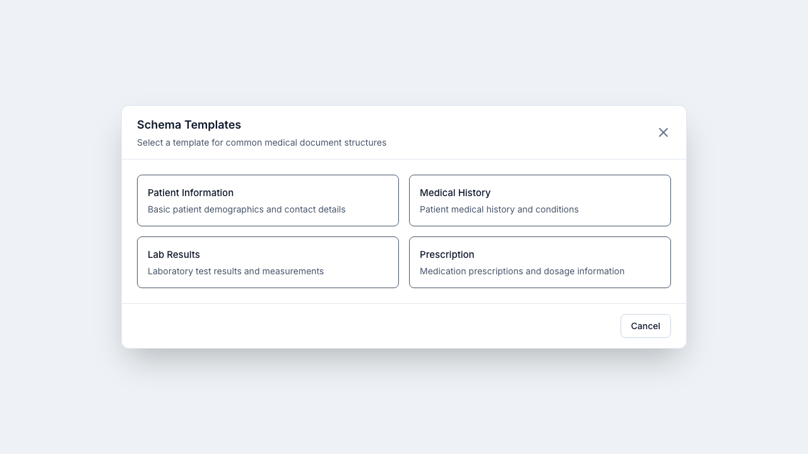
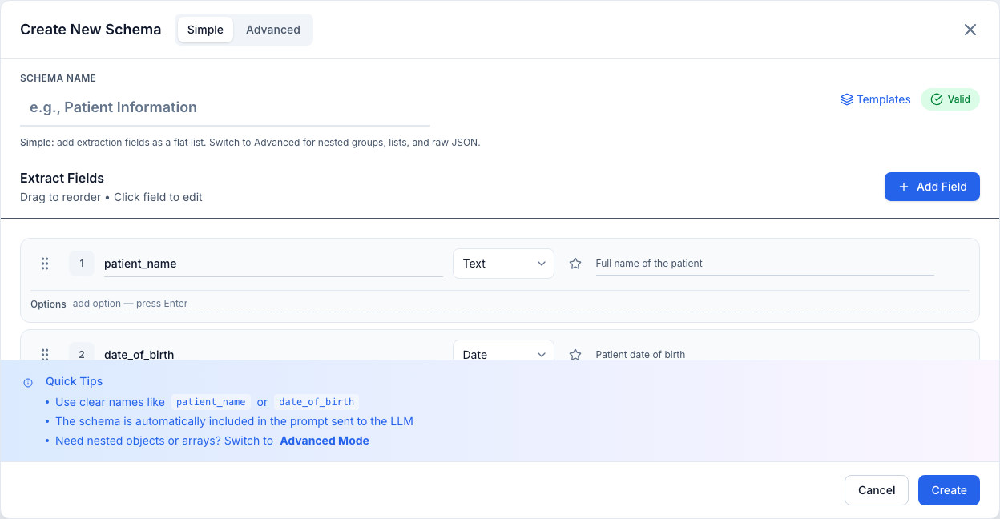
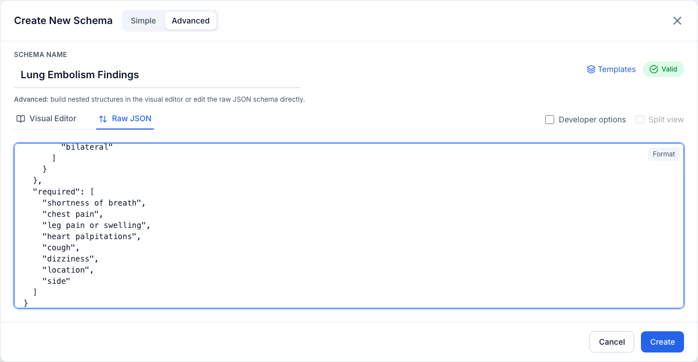
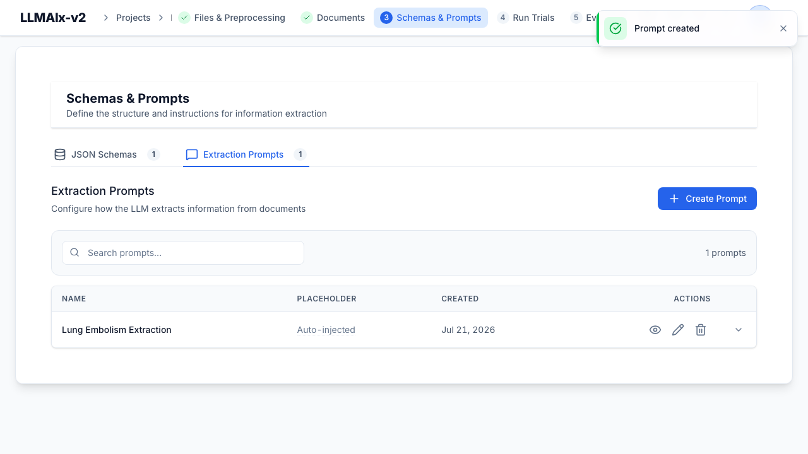
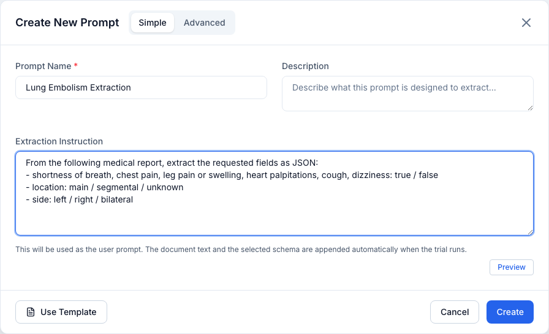

# Schemas & prompts

This tab defines **what** to extract (the schema) and **how** to instruct the
LLM (the prompt). It has two sub-tabs: **JSON Schemas** and **Extraction
Prompts**.

!!! tip "The schema is injected automatically"
    You do **not** paste the schema JSON into your prompt. The selected schema is
    automatically included in the LLM call when a trial runs.

## Schemas

A **schema** is a JSON schema describing your desired output structure — nested
objects, arrays, and every JSON type.

### The schemas list

The **JSON Schemas** section lists every schema in the project. A search box
filters by name, and each row shows the **Name** (with a one-line field summary
beneath it) and its **Created** date. Rows are **expandable** — click one to
preview its fields inline without opening the full editor. Row actions are
**View**, **Edit**, and **Delete**.

<figure markdown>
  { width="820" }
  <figcaption>The JSON Schemas section: each schema with a field summary, created date, and view/edit/delete actions.</figcaption>
</figure>

### Creating a schema

**Create Schema** opens a full-screen editor with a **Simple / Advanced** toggle
in the header. New schemas are pre-seeded with a few starter medical fields. A
validity pill next to the name shows **Valid / Invalid** — a schema is only
saveable once it parses to an object with **at least one field**. A short
mode-hint line under the name explains what the current mode does.

Use **Templates** (available in **both** Simple and Advanced modes) for common
medical structures. Editing an existing schema opens the same editor pre-filled.

!!! note "Unsaved changes are guarded"
    Closing the editor with unsaved edits prompts a **Discard unsaved changes?**
    confirmation. Switching modes or tabs re-serializes the same schema and does
    **not** count as an edit.

#### Templates

The **Templates** picker offers four ready-made structures — **Patient
Information**, **Medical History**, **Lab Results**, and **Prescription** — that
demonstrate nested objects, arrays of objects, enums, and formats. Applying a
template replaces the current name and definition with the template's.

<figure markdown>
  { width="820" }
  <figcaption>The Schema Templates picker with common medical document structures.</figcaption>
</figure>

### Simple editor

A flat, drag-to-reorder list of fields, driven by an **Add Field** button (and a
matching empty state for a brand-new list). Each editable field row has:

- A **drag handle** (grip) — press and drag to reorder; dragging is armed only
  while the handle is held, so selecting text inside the inputs still works.
- A **field number** badge.
- **Field name** (e.g. `patient_name`).
- **Type** — Text, Number, Integer, Yes/No, Date, Date & Time, Email.
- **Required** — the **star** toggle (adds the field to the schema's `required`
  list, telling the LLM the value must be present).
- **Description** (shown on wider screens).
- A **remove** button (appears on hover).
- **Options** (Text fields only) — a list of allowed values (a string enum).
  Type a value and press **Enter** or comma to add it; **Backspace** in the empty
  input removes the last chip; click a chip's × to remove it.

Empty or duplicate field names are flagged inline in red and **block saving**
(they'd otherwise be silently dropped or overwritten). A **Quick Tips** footer
reminds you of naming conventions and points to Advanced mode for nested data.

<figure markdown>
  { width="820" }
  <figcaption>The Simple editor: per-field name, type, required star, and description, with Add Field, Templates, a Valid pill, and Quick Tips.</figcaption>
</figure>

!!! note "Advanced fields are read-only here"
    Fields the simple editor can't represent losslessly — nested groups, lists,
    non-text enums, string enums that also carry a format, length/number
    constraints, unknown formats — appear as **locked amber rows** with a lock
    icon and a *"edit in Advanced"* hint. They are preserved untouched on save;
    switch to **Advanced** to edit them. A warning callout at the top of the list
    notes when read-only fields are present.

### Advanced editor

Advanced mode replaces the flat list with two tabs plus extra toggles in the
header:

- **Visual Editor** — a navigable tree of blocks (see below).
- **Raw JSON** — a JSON editor with a **Format** button that pretty-prints and
  re-syncs the visual tree.
- **Split view** — show the visual editor and raw JSON side by side. It only
  applies to the Visual Editor tab (it's disabled on the Raw JSON tab, which is
  already the JSON pane).
- **Developer options** — switch labels to JSON-Schema type names (String,
  Number, Boolean, Object, Array) and expose extra per-field settings.

<figure markdown>
  { width="820" }
  <figcaption>Advanced mode, Raw JSON tab, showing the full JSON schema with the Format helper.</figcaption>
</figure>

The visual editor supports arbitrarily deep **objects** (groups of fields) and
**arrays** (lists, including lists of objects). A breadcrumb toolbar and a
collapsible **Structure** tree on the left let you navigate into nested objects
and array `items`; a keyboard shortcut (**N**) adds a property to the current
block. Adding, editing, renaming, or deleting a property is done through
dedicated modals, and a **Help** modal documents the available types.

The property editor exposes type-specific settings:

- **Text** — min/max length, **format** (email, URL, date, date-time, time,
  IPv4/IPv6, UUID), regex **pattern**, allowed values (enum).
- **Number** — min/max, *multiple of*, **Integer only**.
- **List (array)** — min/max items, *items must be unique*, and the type of its
  items (including objects).
- **Group (object)** — which child fields are **required**, and (developer mode)
  whether to allow additional properties.
- **Additional** — default value, read-only flag, examples.

Property keys must be valid identifiers (letters, numbers, underscores; not
starting with a number). Renaming a property keeps its place in the parent's
`required` list.

### Viewing, editing, deleting

**View Schema** shows the fields (with a **raw-JSON toggle** and a **Copy**
button that copies the formatted JSON). A schema embedded in a trial is shown
with a **Snapshot** badge, indicating a point-in-time copy rather than the live
schema. There is no separate file import/export — the **Raw JSON** editor is how
you paste a schema in, and **Copy** is how you take one out.

!!! note
    A schema referenced by a trial cannot be deleted.

## Prompts

A **prompt** tells the LLM how to extract. Prompts pair a **system prompt** (the
model's role and rules, applied to every document) with a **user prompt**
(per-document instructions).

### The prompts list

The **Extraction Prompts** section lists every prompt, with a search box that
matches name and description. Each row shows the **Name** (with description
beneath), a **Placeholder** column, and the **Created** date, and expands to
preview the system and user prompt text. The Placeholder column shows a green
**Contains {document_content}** badge when the prompt embeds the placeholder
explicitly, or an **Auto-injected** hint (with a tooltip) when it doesn't — in
which case the document text is appended automatically at trial time. Row actions
are **View**, **Edit**, and **Delete**.

<figure markdown>
  { width="820" }
  <figcaption>The Extraction Prompts section: each prompt with its placeholder status and view/edit/delete actions.</figcaption>
</figure>

### The document-content placeholder

Where you write `{document_content}`, the document's text is substituted in. If
your prompt doesn't contain the placeholder, the document text is **appended
automatically** at trial time (shown as the *Auto-injected* hint in the list).

### Creating a prompt

**Create Prompt** opens an editor with a **Simple / Advanced** toggle. Every
prompt needs a **Name** (required) and may have an optional **Description**.

<figure markdown>
  { width="820" }
  <figcaption>The Prompt editor in Simple mode: a single extraction instruction, with the system prompt and schema injected automatically at trial time.</figcaption>
</figure>

- **Simple** — a single **Extraction Instruction** (used as the user prompt); no
  system prompt is sent. **Preview** shows the real message the model receives:
  your instruction, the document content wrapped in markers, and a note that the
  trial's schema is appended after it.
- **Advanced** — separate **System Prompt** and **User Prompt** textareas, each
  with an **Insert {document_content}** helper (inserts at the cursor) and a
  green **Contains {document_content}** badge when present, plus a per-field
  **Preview** that substitutes a sample document. At least one prompt must be
  present and the placeholder must appear in one of them, or save is blocked with
  an inline error.

Use **Use Template** to apply the built-in medical extraction prompt. Because the
template uses a system prompt and an explicit `{document_content}` placeholder,
it switches you to Advanced mode; if you've already typed anything, a
confirmation guards the overwrite. Closing with unsaved edits prompts a
**Discard unsaved changes?** confirmation.

!!! warning "Simple mode drops the system prompt"
    Saving in Simple mode sends an empty system prompt. The system-prompt text
    isn't wiped from the form while you edit — it's only omitted from the saved
    payload — so toggling Advanced → Simple → Advanced won't destroy it. Editing
    a prompt that already has a system prompt (or an explicit `{document_content}`
    placeholder) automatically opens in Advanced mode so you don't wipe it by
    accident.

!!! note
    A prompt referenced by a trial cannot be deleted.

## Next step

With a schema and a prompt ready, run a **[trial](trials.md)**.
