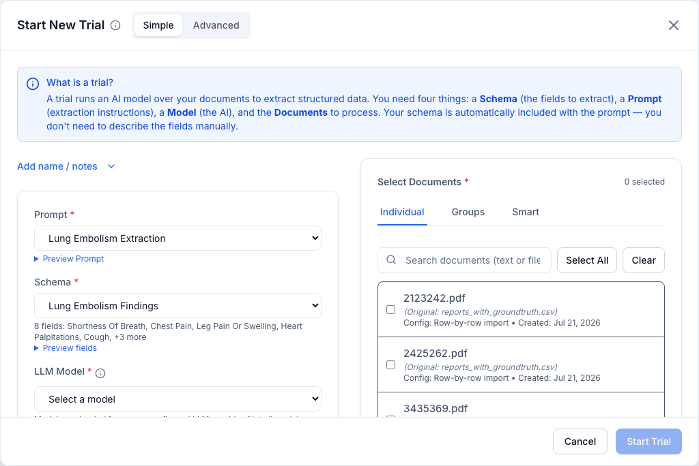
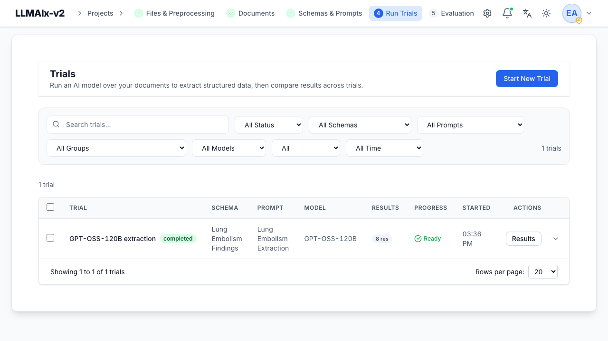
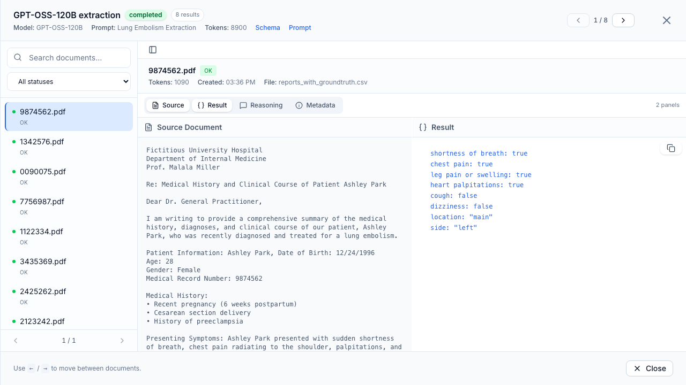
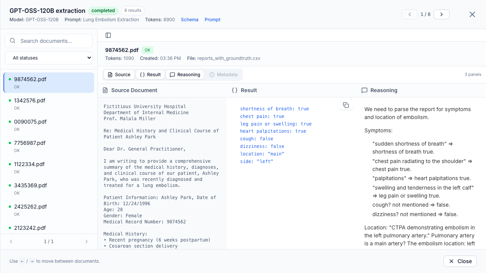

# Trials

A **trial** runs an LLM over a set of documents to extract structured data
matching your schema. Each document produces one result. This page covers
creating, running, and inspecting trials.

!!! info "Prerequisites"
    The **Start New Trial** button is disabled until the project has at least
    one **schema**, one **prompt**, and one **document**. The button's tooltip
    tells you which is missing.

## Creating a trial

**Start New Trial** opens a dialog with a **Simple / Advanced** toggle at the top
and a **"What is a trial?"** info tooltip next to the title. Four inputs are
required:

1. **Prompt** — the extraction instructions. Use **Preview prompt** to read the
   system/user templates inline before committing.
2. **Schema** — the output structure. Use **Preview fields** to inspect the
   schema's fields inline.
3. **LLM Model** — chosen from the models your endpoint exposes. Not every model
   supports structured JSON output; see [model compatibility](#model-compatibility).
4. **Documents** — which documents to run over (right-hand panel).

An optional **name** and **description** can be added. In Simple mode these are
collapsed behind an *Add name / notes* link; in Advanced mode the metadata card
is always shown. The prompt and schema selectors default to the first available
of each when the dialog opens.

<figure markdown>
  { width="820" }
  <figcaption>The Start New Trial dialog: mode toggle and "What is a trial?" help (top), the Prompt / Schema / LLM Model selectors on the left, and the Individual / Groups / Smart document panel on the right.</figcaption>
</figure>

### Selecting documents

The document panel (required, marked with a red asterisk) shows a running count
of how many documents are selected and has three tabs:

- **Individual** — a searchable, server-paginated list; tick documents one by one.
  **Select All** fetches every document matching the current search across *all*
  pages (not just the visible page), and **Clear** empties the selection. Search
  is debounced and re-queries the backend.
- **Groups** — pick a single [document group](documents.md#document-groups) to run
  against its members. Selecting a group loads all of its member document IDs;
  an empty group warns you. Selecting a second group replaces the first, and
  clicking the selected group again deselects it.
- **Smart** — three shortcuts for reusing selections:
    - **Load from Previous Trial** — copies the exact document set of a chosen
      completed trial (only completed trials with documents are offered).
    - **Last 7 days** / **Last 30 days** — selects every document created within
      that window.
    - **Filter by Date Range** — selects documents created between two dates
      (end date inclusive).

### Advanced settings

In Advanced mode an **Advanced Settings** section adds three optional tuning
inputs (all blank by default, in which case the model's own defaults apply):

- **Max Completion Tokens** — upper bound on the response length. Only sent when
  set to a positive integer.
- **Temperature** — sampling randomness, `0`–`2`. Lower is more deterministic.
- **Reasoning Effort** — *Use model default / Low / Medium / High*. Only some
  reasoning models honor this; it is ignored by models that don't.

Changing any advanced setting resets the model-compatibility check, so it is
re-verified against the new options on submit.

### Using a different API

Under **Use Custom API Settings** you can point the trial at any
OpenAI-compatible endpoint (OpenAI, Ollama, vLLM, llama.cpp, self-hosted
gateways, …) with its own **API Key** and **Base URL**. This escape hatch is
available in both Simple and Advanced mode. When you edit either field the app
debounces, then re-tests the connection and reloads the model list, clearing any
previously selected model. If no system endpoint is configured, Simple mode shows
a warning prompting you to supply custom settings.

!!! note "Your API key is protected"
    Custom API keys are stored **encrypted**, never returned in API responses,
    and never included in exports.

### Model compatibility

The model list shows the raw model IDs your endpoint reports — appearing in the
list doesn't guarantee structured-output support. When you click **Start Trial**,
the app first runs a quick compatibility check (that the model accepts a JSON
schema request against your chosen schema) and stops with an explanation if it
fails. The dialog's inline status line tells you what is still needed (choose a
model, select documents, fix the endpoint) or confirms *Verified — ready*.

In Advanced mode you can run this check manually from the **Model & Schema
Compatibility** card without submitting, and see the pass/fail reason there. In
Simple mode the check runs silently on **Start Trial** behind a spinner overlay.

!!! tip "Discard protection"
    Closing the dialog after you've edited any field prompts a *Discard changes?*
    confirmation. An untouched open/close (the defaults are pre-filled) closes
    without prompting.

## Running, progress, and status

Trials run as background tasks (or, for admins only, synchronously via an
API-level `bypass_celery` option). The trials table shows live **progress**
(`done / total`) and a status: **Pending → Processing → Ready** (completed),
**Failed**, or **Cancelled**. Progress and status update in real time over a
WebSocket, so you don't need to refresh.

<figure markdown>
  { width="820" }
  <figcaption>The trials list: each trial shows its status and creation time, with a Results action to open the viewer.</figcaption>
</figure>

!!! tip "Snapshots are frozen"
    A trial stores a **snapshot** of the schema and prompt as they were when it
    ran. Editing or deleting the source schema/prompt afterward does not change
    what the trial displays, exports, or re-runs.

### Cancelling

Active trials can be **Cancelled**. A dialog offers to keep already-processed
results.

!!! warning "Partial results on cancel"
    By default a cancelled trial **discards** its partial results (they are
    rolled back). Treat cancellation as "stop and throw away", not "stop and
    keep", unless you know your deployment changed this default.

### Retrying failures

**Retry** clones the trial into a new one (preserving the custom endpoint, key,
document set, name, and description). If the trial had per-document failures you
can choose **Retry failed documents only** or **Re-run all documents**. Retrying
failed-only re-processes just the documents that errored, leaving successful
results untouched.

## Viewing results

**Results** opens the trial results viewer. The header shows the model, prompt,
document set, total **token** usage, and links to the frozen schema/prompt. A
**left rail** lists every document with its result status; you can search it and
filter by status:

- **Success**, **Failed**, **Incomplete**, **Invalid JSON**, **Schema invalid**,
  **Refused**, **Provider error**.

<figure markdown>
  { width="820" }
  <figcaption>The results viewer: a searchable document list (left), a header with model / prompt / token totals and schema/prompt links, and the Source Document and extracted-JSON Result panels side by side.</figcaption>
</figure>

Navigate documents with the header arrows or the **←/→** keys. For each document
you can open up to three panels side by side:

- **Source Document** — the original file preview or the extracted text.
- **Result** — the extracted JSON (with **Copy JSON**).
- **Reasoning** — the model's reasoning content, when present.
- **Metadata** — token usage, finish reason, and any JSON error.

<figure markdown>
  { width="820" }
  <figcaption>With a reasoning-capable model, a third **Reasoning** panel shows the chain-of-thought behind each field; per-document and total token usage appear in the header.</figcaption>
</figure>

Failed documents show an error banner with **tuning advice** (suggested prompt
or setting changes). The **"{N} errors"** header link lists all failures; click
one to jump to that document.

## Filtering and managing trials

The filter bar offers search plus **Status**, **Schema**, **Prompt**, **Document
Group**, **LLM Model**, **Errors** (*Has errors / No errors*), and **Date Range**
filters.

- **Rename** — change a trial's name/description.
- **Delete** — removes the trial *and its results and any evaluations based on
  it* (running trials must be cancelled first). Batch-delete via the selection
  bar.

## Downloading results

**Download** exports results in one of two formats:

- **JSON (per-document, ZIP)** — one JSON file per document plus `metadata.json`.
- **CSV (table)** — one row per document. Bundled into a ZIP when document
  content is included; otherwise a single flat `.csv`.

The dialog offers three content toggles:

- **Include document content** — adds each document's extracted text and its
  source file to the archive. This is what turns a CSV export into a ZIP.
- **Include reasoning** — adds the model's reasoning content for each result.
- **Include token usage** — adds per-document token counts.

Sensitive keys (API keys) are always stripped from exports. The download is named
after the trial (its slugified name, or `trial_<N>` when unnamed). For an
unfinished trial — one that **failed** or was **cancelled** — the export contains
only the successfully extracted documents and is labelled a *partial* download,
with a note showing how many results are included.

## Next step

To measure how good a trial's results are, upload
**[ground truth](ground-truth.md)** and run an **[evaluation](evaluation.md)**.
</content>
</invoke>
