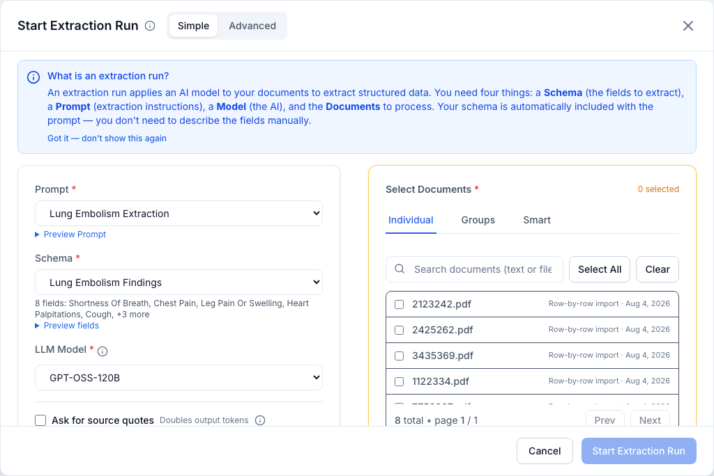
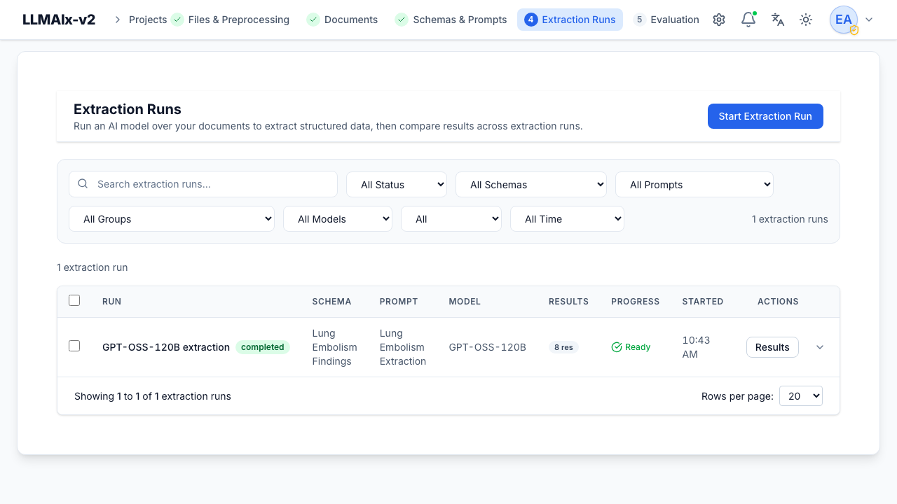
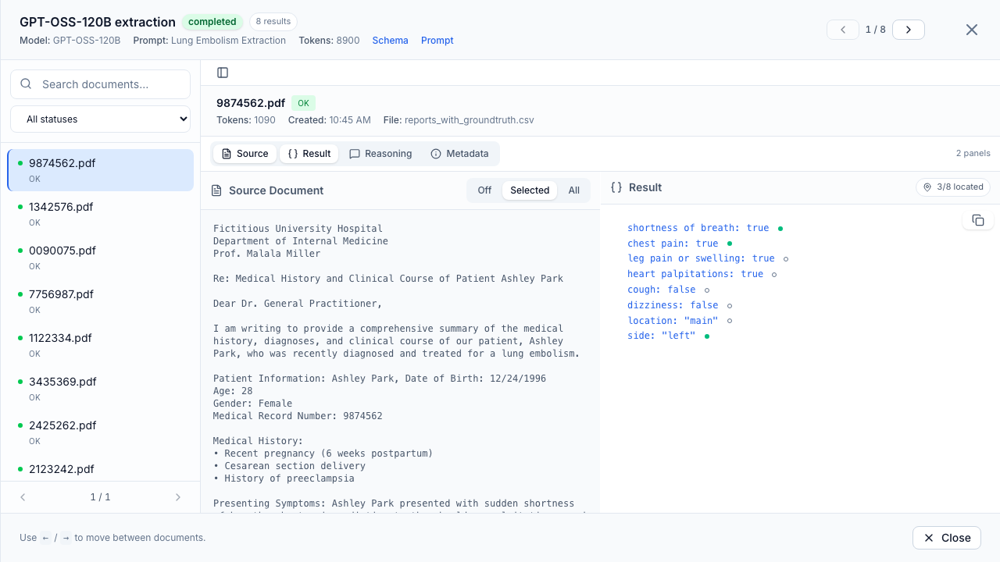
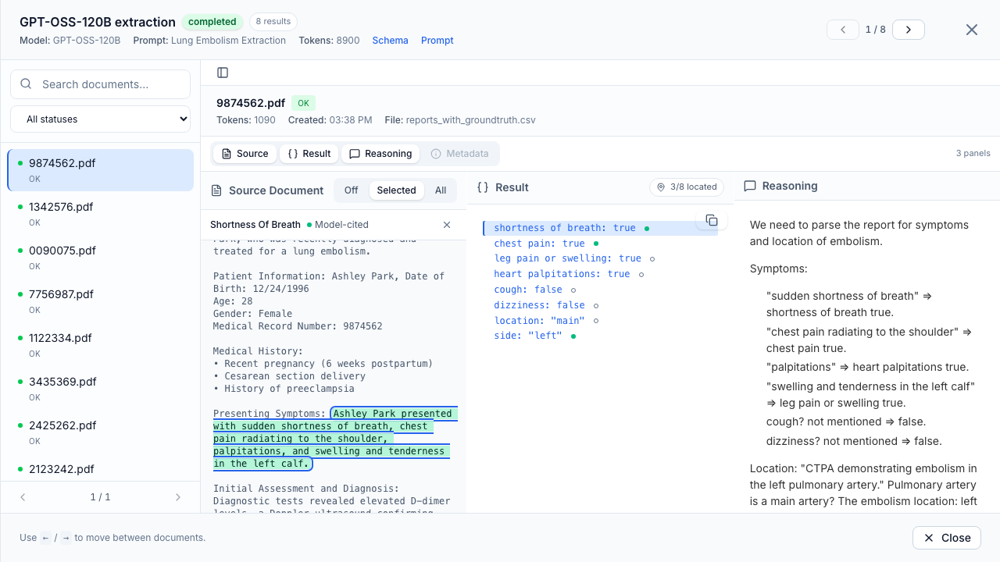
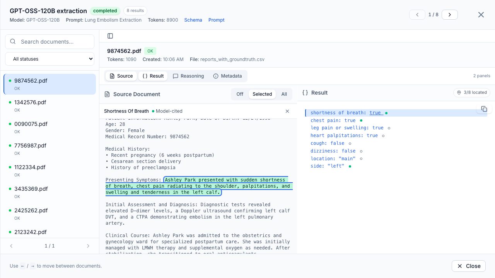

# Extraction Runs

An **extraction run** (formerly called a "trial" — the API and database still
use the term `trial`) runs an LLM over a set of documents to extract structured
data matching your schema. Each document produces one result. This page covers
creating, running, and inspecting extraction runs.

!!! info "Prerequisites"
    The **Start Extraction Run** button is disabled until the project has at
    least one **schema**, one **prompt**, and one **document**. The button's
    tooltip tells you which is missing.

## Creating an extraction run

**Start Extraction Run** opens a dialog with a **Simple / Advanced** toggle at
the top and a **"What is an extraction run?"** info tooltip next to the title.
Four inputs are required, and any of them still missing is outlined in amber:

1. **Prompt** — the extraction instructions. Use **Preview prompt** to read the
   system/user templates inline before committing.
2. **Schema** — the output structure. Use **Preview fields** to inspect the
   schema's fields inline.
3. **LLM Model** — chosen from the models your endpoint exposes. Not every model
   supports structured JSON output; see [model compatibility](#model-compatibility).
4. **Documents** — which documents to run over (right-hand panel).

Below the model selector, in both modes, is one optional checkbox:

- **Ask for source quotes** — off by default. When enabled, the model is also
  asked to return the verbatim passage each value was read from, which the
  results viewer uses to highlight sources (see
  [Tracing values back to the document](#tracing-values-back-to-the-document)).
  The quotes are stripped out of the stored result, so the extracted JSON keeps
  exactly the shape your schema describes and evaluation is unaffected. It
  roughly doubles output tokens and cost.

An optional **name** and **description** can be added below the required inputs.
In Simple mode these are collapsed behind an *Add name / notes* link; in Advanced
mode the metadata card is always shown.

The prompt and schema selectors default to the first available of each when the
dialog opens. The model selector is pre-filled with the **last model this project
ran successfully**, or with the only model on offer if your endpoint exposes just
one; otherwise it stays empty and is marked amber until you choose. A first-run
**"What is an extraction run?"** primer appears above the form and can be
dismissed for good — its text remains under the ⓘ next to the dialog title.

<figure markdown>
  { width="820" }
  <figcaption>The Start Extraction Run dialog, scrolled to the LLM Model selector: the optional <strong>Ask for source quotes</strong> checkbox sits directly below it in both modes, with the document selection panel on the right.</figcaption>
</figure>

### Selecting documents

The document panel (required, marked with a red asterisk) shows a running count
of how many documents are selected and has three tabs:

- **Individual** — a searchable, server-paginated list; tick documents one by one.
  **Select All** fetches every document matching the current search across *all*
  pages (not just the visible page), and **Clear** empties the selection. Search
  is debounced and re-queries the backend.
- **Groups** — pick a single [document group](documents.md#document-groups) to run
  against its members. Selecting a group loads all of its member document IDs;
  an empty group warns you. Selecting a second group replaces the first, and
  clicking the selected group again deselects it.
- **Smart** — three shortcuts for reusing selections:
    - **Load from Previous Run** — copies the exact document set of a chosen
      completed extraction run (only completed runs with documents are offered).
    - **Last 7 days** / **Last 30 days** — selects every document created within
      that window.
    - **Filter by Date Range** — selects documents created between two dates
      (end date inclusive).

### Advanced settings

In Advanced mode an **Advanced Settings** section adds three optional tuning
inputs (all blank by default, in which case the model's own defaults apply):

- **Max Completion Tokens** — upper bound on the response length. Only sent when
  set to a positive integer.
- **Temperature** — sampling randomness, `0`–`2`. Lower is more deterministic.
- **Reasoning Effort** — *Use model default / Low / Medium / High*. Only some
  reasoning models honor this; it is ignored by models that don't.
- **Prompt Language** — defaults to the interface language. Besides your own
  prompt text, every request carries instructions the app adds: a notice telling
  the model to treat the document as untrusted data, the line introducing the
  JSON schema, and (with source quotes on) the citation rules. These follow this
  setting, so a German prompt over a German report isn't diluted with English
  scaffolding. Change it if you run the app in one language and extract in
  another.

Changing any advanced setting resets the model-compatibility check, so it is
re-verified against the new options on submit.

### Using a different API

Under **Use Custom API Settings** you can point the extraction run at any
OpenAI-compatible endpoint (OpenAI, Ollama, vLLM, llama.cpp, self-hosted
gateways, …) with its own **API Key** and **Base URL**. This escape hatch is
available in both Simple and Advanced mode. When you edit either field the app
debounces, then re-tests the connection and reloads the model list, clearing any
previously selected model. If no system endpoint is configured, Simple mode shows
a warning prompting you to supply custom settings.

!!! note "Your API key is protected"
    Custom API keys are stored **encrypted**, never returned in API responses,
    and never included in exports.

### Model compatibility

The model list shows the raw model IDs your endpoint reports — appearing in the
list doesn't guarantee structured-output support. When you click **Start
Extraction Run**, the app first runs a quick compatibility check (that the model
accepts a JSON schema request against your chosen schema) and stops with an
explanation if it fails. The dialog's inline status line tells you what is still
needed (choose a model, select documents, fix the endpoint) or confirms
*Verified — ready*.

In Advanced mode you can run this check manually from the **Model & Schema
Compatibility** card without submitting, and see the pass/fail reason there. In
Simple mode the check runs silently on **Start Extraction Run** behind a spinner
overlay.

!!! tip "Discard protection"
    Closing the dialog after you've edited any field prompts a *Discard changes?*
    confirmation. An untouched open/close (the defaults are pre-filled) closes
    without prompting.

## Running, progress, and status

Extraction runs execute as background tasks (or, for admins only, synchronously
via an API-level `bypass_celery` option). The runs table shows live **progress**
(`done / total`) and a status: **Pending → Processing → Ready** (completed),
**Failed**, or **Cancelled**. Progress and status update in real time over a
WebSocket, so you don't need to refresh.

<figure markdown>
  { width="820" }
  <figcaption>The extraction runs list: each run shows its status and creation time, with a Results action to open the viewer.</figcaption>
</figure>

!!! tip "Snapshots are frozen"
    An extraction run stores a **snapshot** of the schema and prompt as they
    were when it ran. Editing or deleting the source schema/prompt afterward
    does not change what the run displays, exports, or re-runs.

### Cancelling

Active extraction runs can be **Cancelled**. A dialog offers to keep
already-processed results.

!!! warning "Partial results on cancel"
    By default a cancelled extraction run **discards** its partial results (they
    are rolled back). Treat cancellation as "stop and throw away", not "stop and
    keep", unless you know your deployment changed this default.

### Retrying failures

**Retry** clones the extraction run into a new one (preserving the custom
endpoint, key, document set, name, and description). If the run had per-document
failures you can choose **Retry failed documents only** or **Re-run all
documents**. Retrying failed-only re-processes just the documents that errored,
leaving successful results untouched.

## Viewing results

**Results** opens the extraction results viewer. The header shows the model,
prompt, document set, total **token** usage, and links to the frozen
schema/prompt. A **left rail** lists every document with its result status; you
can search it and filter by status:

- **Success**, **Failed**, **Incomplete**, **Invalid JSON**, **Schema invalid**,
  **Refused**, **Provider error**.

<figure markdown>
  { width="820" }
  <figcaption>The results viewer: a searchable document list (left), a header with model / prompt / token totals and schema/prompt links, and the Source Document and extracted-JSON Result panels side by side.</figcaption>
</figure>

Navigate documents with the header arrows or the **←/→** keys. For each document
you can open up to three panels side by side:

- **Source Document** — the original file preview or the extracted text.
- **Result** — the extracted JSON (with **Copy JSON**).
- **Reasoning** — the model's reasoning content, when present.
- **Metadata** — token usage, finish reason, and any JSON error.

<figure markdown>
  { width="820" }
  <figcaption>With a reasoning-capable model, a third **Reasoning** panel shows the chain-of-thought behind each field; per-document and total token usage appear in the header.</figcaption>
</figure>

Failed documents show an error banner with **tuning advice** (suggested prompt
or setting changes). The **"{N} errors"** header link lists all failures; click
one to jump to that document.

A **Document view / Table view** toggle in the header switches to a
cross-document table: one row per document, one column per schema field, so you
can scan a single field across the whole extraction run at a glance. Clicking a
column header sorts the current page by that column, and clicking a document
name jumps back to the document view with that document open; failed documents
appear as a single error row. The table pages through the same result set as
the document view, and your choice of view is remembered per project.

### Tracing values back to the document

Every extracted value in the **Result** panel carries a small coloured dot.
Click the value and the **Source Document** panel scrolls to the passage the
value most likely came from and highlights it. Clicking a highlight works the
other way round, selecting the value that passage supports. When a value occurs
more than once, a **1 / 3** stepper walks through the occurrences.

<figure markdown>
  { width="820" }
  <figcaption>Clicking <code>shortness of breath</code> highlights the passage it was read from and names how it was matched ("Field mentioned"). The dots beside each value show its match grade; the header chip counts how many values were located.</figcaption>
</figure>

The **Highlight** control in the Source panel header switches between:

- **Off** — no highlighting.
- **Selected** — only the value you clicked (the default).
- **All** — every located value at once, colour-coded. Hovering a highlight
  names the field it belongs to. This is the quickest way to see how much of a
  document a result actually rests on.

Matches are graded, and the grade is shown on hover, because they are not all
equally trustworthy:

| Grade | Colour | Meaning |
| --- | --- | --- |
| **Model-cited** | green | The model quoted this passage as its source (requires **Ask for source quotes**). |
| **Verbatim** | green | The value appears in the text exactly as extracted. |
| **Normalized** | amber | Found ignoring case, spacing, line breaks, hyphenation or accents. |
| **Same number** / **Same date** | amber | The text writes the same value differently (`1,234.50` ≡ `1234.5`, `03/04/1961` ≡ `1961-04-03`). |
| **Field mentioned** | orange | Only the field name appears — the value itself was inferred. Typical for yes/no fields. |
| **Approximate** | orange | A similar passage, found by fuzzy matching. Check it manually. |

A value the search cannot place simply carries **no dot** — the viewer never
claims a value is "not in the document". Plenty of correct answers have nothing
to quote: a yes/no question answered from the sense of a paragraph, a value the
model summarized or derived. Absence of a citation is not evidence against the
extraction.

With **Ask for source quotes** enabled, such a value carries the model's own
short note instead — *"not mentioned"*, *"inferred"* — shown beside it when
selected and on hover. The note is the model's claim, not a citation, and is
capped at a few words by design.

A **stated negative is quoted, not noted**: a `false` read from *"denies chest
pain"* or *"no evidence of embolism"* cites that sentence like any other value,
so you can check it. A note therefore means the document is genuinely silent —
which is the distinction that matters when reviewing a negative finding.

The header chip counts how many values carry a citation (**9/12 located**);
hover it for the ones that don't.

!!! warning "Best-effort by design"
    Except for **Model-cited** matches, highlights come from searching the
    extracted text — the model does not report where it read a value. A value
    without a citation is not necessarily wrong, and a located value is not
    necessarily right. Treat the highlights as a reading aid for review, not as
    a correctness check.

Highlighting works on the **extracted text**, which is what the model was
actually given. When the Source panel is showing the original PDF, selecting a
value switches it to the text view.

## Filtering and managing extraction runs

The filter bar offers search plus **Status**, **Schema**, **Prompt**, **Document
Group**, **LLM Model**, **Errors** (*Has errors / No errors*), and **Date Range**
filters.

- **Rename** — change an extraction run's name/description.
- **Delete** — removes the extraction run *and its results and any evaluations
  based on it* (running extractions must be cancelled first). Batch-delete via
  the selection bar.

## Downloading results

**Download** exports results in one of two formats:

- **JSON (per-document, ZIP)** — one JSON file per document plus `metadata.json`.
- **CSV (table)** — one row per document. Bundled into a ZIP when document
  content is included; otherwise a single flat `.csv`.

The dialog offers three content toggles:

- **Include document content** — adds each document's extracted text and its
  source file to the archive. This is what turns a CSV export into a ZIP.
- **Include reasoning** — adds the model's reasoning content for each result.
- **Include token usage** — adds per-document token counts.

Sensitive keys (API keys) are always stripped from exports. The download is named
after the extraction run (its slugified name, or `trial_<N>` when unnamed). For
an unfinished run — one that **failed** or was **cancelled** — the export
contains only the successfully extracted documents and is labelled a *partial*
download, with a note showing how many results are included.

## Next step

To measure how good an extraction run's results are, upload
**[ground truth](ground-truth.md)** and run an **[evaluation](evaluation.md)**.
